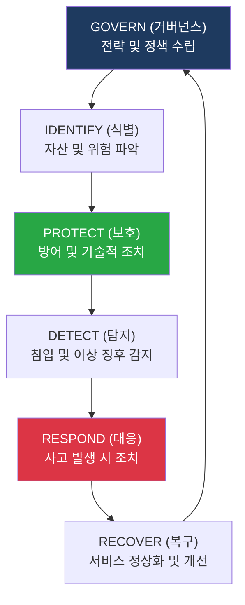
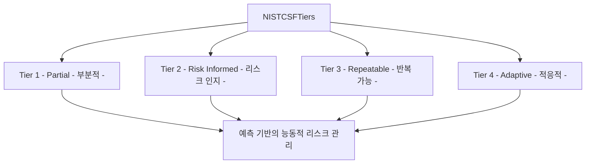

# NIST CSF
**NIST Cybersecurity Framework**

## 1. 전 세계 사이버 보안의 표준 가이드, NIST CSF의 개요

**개념**: 미국 국립표준기술연구소(NIST)에서 제정한 프레임워크로, 조직이 사이버 보안 리스크를 이해, 관리 및 표현할 수 있도록 돕는 공통 언어와 체계.

**특징**: 비즈니스 중심의 유연한 구조, **Core, Tiers, Profiles**의 3대 구성 요소, 최근 2.0 업데이트를 통해 **Governance(거버넌스)** 영역 강화.

---

## 2. NIST CSF 2.0 구성 체계 및 핵심 활동

### 가. 프레임워크 코어 (Core)의 6대 기능

| 기능 (Function) | 설명 | 주요 카테고리 |
|---|---|---|
| **Govern** | 조직의 사이버 보안 전략, 역할 및 책임 관리 | 문정 수립, 리스크 관리 전략 |
| **Identify** | 자산, 비즈니스 환경, 공급망 리스크 식별 | 자산 관리, 취약점 분석 |
| **Protect** | 데이터 보호 및 인프라 회복력 확보 | 접근 통제, 암호화, 교육 훈련 |
| **Detect** | 사이버 보안 이벤트의 적시 발견 | 상시 모니터링, 이상 행위 탐지 |
| **Respond / Recover** | 사고 대응 및 비즈니스 연속성 확보 | 대응 계획, 복구 및 학습 |

---

### 나. Implementation Tiers (구현 단계)

| Tier | 수준 | 특징 |
|---|---|---|
| **Tier 1** | Partial | 리스크 관리가 임시방편적이며 외부 협력 부재 |
| **Tier 2** | Risk Informed | 조직적 차원의 인식은 있으나 일관된 프로세스 부족 |
| **Tier 3** | Repeatable | 공식적인 리스크 관리 정책이 전사적으로 수행됨 |
| **Tier 4** | Adaptive | 지속적 개선과 예측 기술을 통한 최첨단 대응 |

---

## 3. NIST CSF 활용의 기대효과 및 도입 전략

| 구분 | 주요 기대효과 | 활용 및 실무 적용 방안 |
|---|---|---|
| **공통 언어** | 부서 간 원활한 의사소통 | 비즈니스 리더와 보안 전문가 간의 리스크 대화 표준으로 활용 |
| **유연한 적용** | 조직 특성에 맞는 프로파일링 | 현재 상태(As-Is)와 목표 상태(To-Be)를 정의하여 투자 우선순위 결정 |
| **공급망 관리** | 파트너사 보안 수준 평가 | 공급망 보안 리스크 관리를 위한 기준으로 활용 |
| **글로벌 호환** | 국제적 신뢰도 확보 | ISO 27001 등 타 표준과 연계하여 통합 보안 체계 구축 |
