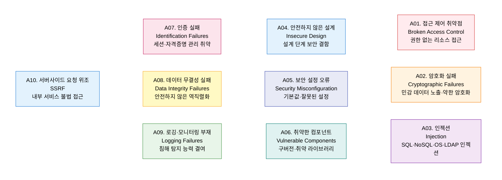

# OWASP Top 10
**Open Web Application Security Project — 웹 애플리케이션 10대 보안 취약점**

## 1. 웹 애플리케이션 10대 보안 취약점을 정의하는 글로벌 표준, OWASP Top 10의 개요

**정의**: OWASP(오픈 웹 애플리케이션 보안 프로젝트)가 전 세계 취약점 데이터를 분석하여 3~4년 주기로 발표하는 **웹 애플리케이션 10대 보안 취약점 목록**으로, 개발자·보안 담당자·감리자가 웹 보안의 공통 언어로 활용하는 글로벌 표준.

**특징**:  
 **(위험 기반 우선순위)** 발생 빈도·공격 가능성·비즈니스 영향도를 종합한 위험 기반 우선순위 산정.  
 **(설계 보안 강조)** 2021년 버전에서 **안전하지 않은 설계(A04)** 를 신규 추가 — 설계 단계 보안의 중요성 강조.  
 **(보안 기준 연계)** PCI-DSS·ISO 27001·국내 ISMS-P 보안 점검 기준으로 광범위하게 활용.  

---

## 2. OWASP Top 10의 핵심 구성 체계

### 가. 10대 웹 애플리케이션 취약점 (2021)

---

### 나. 취약점별 탐지 및 완화 방안

| 순위 | 취약점 | 공격 시나리오 | 탐지 방법 | 완화 방안 |
|---|---|---|---|---|
| **A01** | 접근 제어 취약점 | URL 직접 접근·파라미터 변조·IDOR | 접근 로그 이상 탐지 | 서버사이드 권한 검증·최소 권한 원칙 |
| **A02** | 암호화 실패 | 평문 전송·약한 해시(MD5)·하드코딩 키 | 패킷 분석·코드 리뷰 | TLS 1.2+·AES-256·PBKDF2 해시 |
| **A03** | 인젝션 | SQL 인젝션·OS 명령 인젝션·XSS | DAST·WAF 룰 탐지 | PreparedStatement·입력 유효성 검증·파라미터화 쿼리 |
| **A04** | 안전하지 않은 설계 | 비즈니스 로직 취약점·레이트 리밋 부재 | 위협 모델링(STRIDE) | 설계 단계 보안 요구사항 정의·위협 모델링 |
| **A05** | 보안 설정 오류 | 기본 계정·불필요한 기능·디렉토리 노출 | 구성 검사 도구 | 최소 기능 활성화·CIS Benchmark 적용 |
| **A06** | 취약한 컴포넌트 | Log4Shell·Spring4Shell·구버전 라이브러리 | SBOM·SCA 도구 | 정기 의존성 업데이트·Snyk·Dependabot |
| **A07** | 인증 실패 | 자격증명 스터핑·세션 탈취·약한 패스워드 | 로그인 실패 모니터링 | MFA·세션 타임아웃·패스워드 정책 강화 |
| **A08** | 데이터 무결성 실패 | 역직렬화 공격·CI/CD 파이프라인 조작 | 서명 검증·무결성 검사 | 신뢰할 수 없는 데이터 역직렬화 금지·서명 검증 |
| **A09** | 로깅·모니터링 부재 | 침해 사고 장기 미탐지·포렌식 증거 부재 | 로그 공백 탐지 | 중앙화 로그 수집(SIEM)·알람 임계치 설정 |
| **A10** | SSRF | 내부 메타데이터 서버 접근·클라우드 자격증명 탈취 | 아웃바운드 요청 모니터링 | URL 허용 목록·내부망 접근 차단·DNS 리바인딩 방지 |

---

## 3. OWASP Top 10 적용의 기대효과 및 활용 방안

| 구분 | 주요 기대효과 | 활용 및 실무 적용 방안 |
|---|---|---|
| **Secure Coding** | 개발 단계 취약점 사전 제거로 보안 비용 절감 | 코드 리뷰 체크리스트·SAST 도구에 Top 10 기준 반영 |
| **보안 테스트** | 침투 테스트·취약점 점검의 표준 기준 제공 | DAST 도구(OWASP ZAP) 활용하여 Top 10 전수 점검 |
| **컴플라이언스** | PCI-DSS·ISMS-P 웹 취약점 점검 요건 충족 | 정기 보안 점검 시 Top 10 기반 체크리스트 적용 |
| **개발자 교육** | 공통 보안 언어로 개발팀 보안 인식 향상 | 신규 개발자 온보딩·시큐어 코딩 교육 커리큘럼 기준 |
