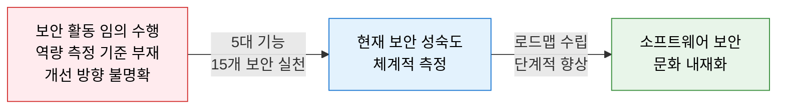
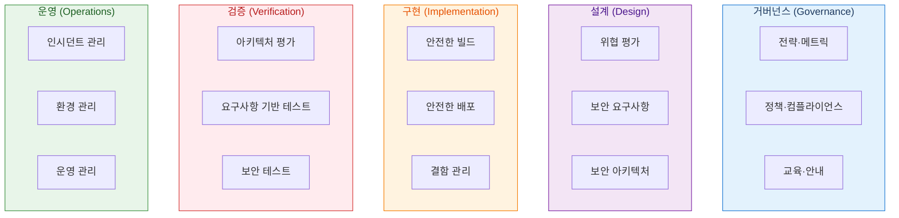
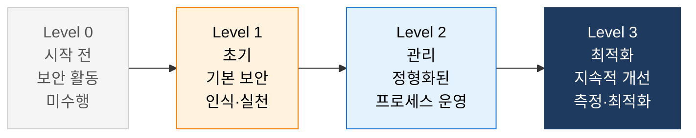
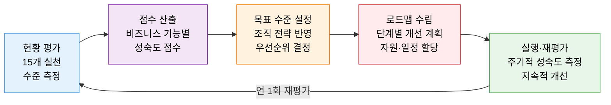

# OWASP SAMM
**Software Assurance Maturity Model — SW 보안 보증 성숙도 모델**

## 1. 소프트웨어 개발 전 생애주기에 걸쳐 보안 역량을 측정하고 단계적으로 향상하는 프레임워크, OWASP SAMM의 개요

**개념**: OWASP가 개발한 소프트웨어 보안 보증 프레임워크로, 조직의 SW 개발 프로세스 전반에 걸쳐 보안 활동을 **5대 비즈니스 기능·15개 보안 실천** 으로 체계화하고, 각 실천의 성숙도를 0~3단계로 측정하여 현행 역량 진단과 목표 수준 달성을 위한 로드맵을 제공하는 성숙도 모델.

**특징**:
- 개발 방법론(Waterfall·Agile·DevOps) **비종속적** — 어떤 개발 환경에도 적용 가능.
- 조직 규모·업종에 맞게 **선택적 실천** 가능 — 15개 중 우선순위를 정해 점진적 도입.
- BSIMM·ISO/IEC 27034와 상호 보완적으로 활용 가능한 **오픈 소스** 프레임워크.

---

## 2. OWASP SAMM의 핵심 구성 체계

### 가. 5대 비즈니스 기능 및 15개 보안 실천

| 비즈니스 기능 | 보안 실천 | 핵심 목적 |
|---|---|---|
| **거버넌스** | 전략·메트릭 | 보안 전략 수립 및 측정 지표 관리 |
| | 정책·컴플라이언스 | 보안 정책 수립 및 규제 준수 체계 |
| | 교육·안내 | 개발자·보안 팀 보안 역량 강화 |
| **설계** | 위협 평가 | 위협 모델링(STRIDE) 및 리스크 식별 |
| | 보안 요구사항 | 기능·비기능 보안 요구사항 정의 |
| | 보안 아키텍처 | 보안 원칙 기반 아키텍처 설계 |
| **구현** | 안전한 빌드 | 취약 컴포넌트 관리·SAST·SBOM |
| | 안전한 배포 | 보안 구성·시크릿 관리·CI/CD 보안 |
| | 결함 관리 | 보안 취약점 추적 및 수정 프로세스 |
| **검증** | 아키텍처 평가 | 설계 단계 보안 검토 및 아키텍처 리뷰 |
| | 요구사항 기반 테스트 | 보안 요구사항 충족 여부 검증 |
| | 보안 테스트 | DAST·펜 테스트·자동화 보안 스캔 |
| **운영** | 인시던트 관리 | 보안 사고 탐지·대응·복구 프로세스 |
| | 환경 관리 | 인프라 보안 설정 및 패치 관리 |
| | 운영 관리 | 운영 중 보안 모니터링 및 개선 |

---

### 나. 성숙도 수준별 보안 역량 평가

**성숙도 수준별 특징 및 달성 기준**

| 수준 | 명칭 | 특징 | 달성 기준 예시 (안전한 빌드) |
|---|---|---|---|
| **Level 0** | 미수행 | 해당 보안 실천이 전혀 이루어지지 않음 | 의존성 취약점 점검 미수행 |
| **Level 1** | 초기 | 임시방편적·비공식적으로 일부 수행 | 빌드 시 알려진 취약 컴포넌트 식별 |
| **Level 2** | 관리 | 공식 프로세스로 정형화·문서화하여 수행 | CI/CD에 SAST·SCA 자동화 통합 |
| **Level 3** | 최적화 | 지속적 개선·측정 지표 기반 최적화 수행 | SBOM 자동 생성·취약점 SLA 관리 |

**SAMM 평가 절차**

---

## 3. OWASP SAMM 도입의 기대효과 및 활용 방안

| 구분 | 주요 기대효과 | 활용 및 실무 적용 방안 |
|---|---|---|
| **보안 역량 진단** | 현재 SW 보안 수준의 객관적 측정 및 벤치마킹 | 연 1회 SAMM 자가 평가로 성숙도 추이 추적 |
| **DevSecOps 연계** | 구현·검증 기능의 보안 자동화를 CI/CD에 통합 | SAST·DAST·SCA 도구를 파이프라인에 내재화 |
| **경영진 보고** | 비즈니스 언어로 보안 투자 효과 측정·보고 | 5대 기능별 성숙도 레이더 차트로 보안 현황 시각화 |
| **컴플라이언스** | ISMS-P·ISO 27034·PCI-DSS 요건과 SAMM 실천 연계 | 인증 심사 대비 SAMM 증거 자료 활용 |
