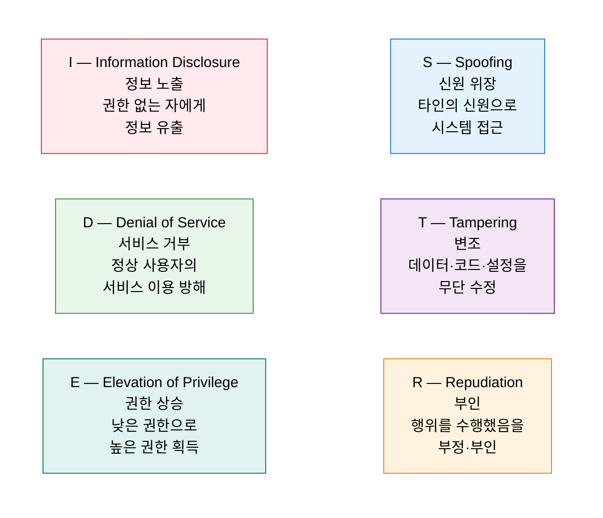
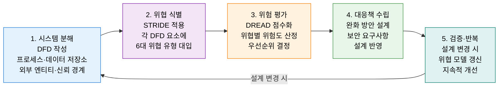

# STRIDE
**보안 위협 모델링 프레임워크**

## 1. 설계 단계 6대 위협 식별로 보안을 내재화하는 위협 모델링 기법, STRIDE의 개요

**정의**: Microsoft가 개발한 위협 모델링 프레임워크로, 소프트웨어 시스템에서 발생 가능한 보안 위협을 **Spoofing(신원 위장), Tampering(변조), Repudiation(부인), Information Disclosure(정보 노출), Denial of Service(서비스 거부), Elevation of Privilege(권한 상승)** 의 6가지 유형으로 분류하여 설계 단계부터 체계적으로 식별·완화하는 위협 모델링 기법.

**특징**:
- **Shift-Left 보안**: 개발 후 취약점을 수정하는 것보다 설계 단계 위협 식별이 비용 효율적.
- DFD(Data Flow Diagram)와 결합하여 시스템 경계·구성 요소·데이터 흐름을 분석 기반으로 활용.
- DREAD·PASTA·TRIKE 등 다른 위협 모델링 방법론과 상호 보완적으로 활용 가능.

---

## 2. STRIDE의 핵심 구성 체계

### 가. STRIDE 6대 위협 유형

| 위협 | 위반 보안 속성 | 공격 사례 | 주요 대응 방안 |
|---|---|---|---|
| **S — Spoofing** | 인증성 (Authentication) | 피싱·세션 하이재킹·ARP 스푸핑 | MFA·디지털 서명·HTTPS 인증서 |
| **T — Tampering** | 무결성 (Integrity) | SQL 인젝션·파라미터 변조·파일 위변조 | 입력 검증·디지털 서명·해시 검증 |
| **R — Repudiation** | 부인 방지 (Non-repudiation) | 거래 부인·로그 삭제·활동 은닉 | 감사 로그·타임스탬프·전자 서명 |
| **I — Information Disclosure** | 기밀성 (Confidentiality) | 데이터 유출·중간자 공격·로그 정보 노출 | 암호화·접근 제어·데이터 마스킹 |
| **D — Denial of Service** | 가용성 (Availability) | DDoS·리소스 고갈·포크 폭탄 | Rate Limiting·WAF·CDN·Auto Scaling |
| **E — Elevation of Privilege** | 권한 부여 (Authorization) | 취약점 익스플로잇·권한 상승 공격 | 최소 권한 원칙·RBAC·샌드박싱 |

---

### 나. 위협 모델링 프로세스 및 DFD 적용

**DFD 요소별 STRIDE 적용 매트릭스**

| DFD 요소 | S | T | R | I | D | E |
|---|:---:|:---:|:---:|:---:|:---:|:---:|
| **외부 엔티티 (External Entity)** | ✓ | | ✓ | | | |
| **프로세스 (Process)** | ✓ | ✓ | ✓ | ✓ | ✓ | ✓ |
| **데이터 흐름 (Data Flow)** | | ✓ | | ✓ | ✓ | |
| **데이터 저장소 (Data Store)** | | ✓ | ✓ | ✓ | ✓ | |

**DREAD 위험 점수 산정 기준**

| DREAD 항목 | 의미 | 점수 (1~10) |
|---|---|---|
| **Damage** | 공격 성공 시 피해 규모 | 높을수록 심각 |
| **Reproducibility** | 공격 재현 용이성 | 높을수록 위험 |
| **Exploitability** | 공격 실행 난이도 | 높을수록 위험 |
| **Affected Users** | 영향받는 사용자 비율 | 높을수록 위험 |
| **Discoverability** | 취약점 발견 용이성 | 높을수록 위험 |

---

## 3. STRIDE 위협 모델링 적용의 기대효과 및 활용 방안

| 구분 | 주요 기대효과 | 활용 및 실무 적용 방안 |
|---|---|---|
| **Shift-Left 보안** | 설계 단계 취약점 조기 발견으로 수정 비용 최소화 | Sprint 계획 시 위협 모델링 세션 포함 (Agile 연계) |
| **보안 요구사항** | 구체적 위협 기반의 실질적 보안 요구사항 도출 | 기능 명세서에 STRIDE 분석 결과를 보안 요건으로 명문화 |
| **DevSecOps 연계** | 위협 모델을 CI/CD 파이프라인 보안 게이트와 연동 | IaC 코드 변경 시 자동 위협 모델 갱신·검토 체계 구축 |
| **컴플라이언스** | ISMS-P·ISO 27001·PCI-DSS 위험 관리 요건 충족 | 연 1회 전체 시스템 위협 모델 리뷰로 감사 증빙 활용 |
