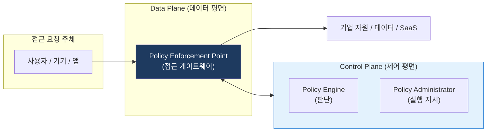
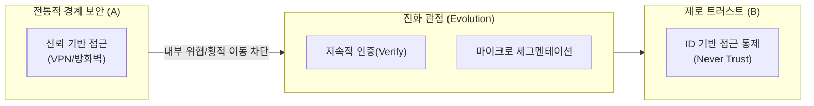

# Zero Trust
**Zero Trust Architecture (ZTA)**

## 1. 신뢰하지 말고 항상 검증하라, 제로 트러스트의 개요

**개념**: "절대 신뢰하지 말고, 언제나 검증하라(Never Trust, Always Verify)"는 원칙 아래, 네트워크 내외부를 불문하고 모든 접근 요청에 대해 최소 권한과 지속적 인증을 적용하는 보안 모델.

**특징**: 경계 기반 보안(Perimeter Security)의 한계 극복, **최소 권한 원칙(Principle of Least Privilege)**, 사용자/기기/환경의 컨텍스트 기반 의사결정.

---

## 2. 제로 트러스트 아키텍처 및 핵심 가이드라인

### 가. 제로 트러스트 논리 모델 (NIST SP 800-207)

| 구성 요소 | 역할 설명 | 관련 기술 |
|---|---|---|
| **Policy Engine** | 접근 허용 여부 최종 판단 | IAM, 위험 분석 AI |
| **Policy Admin** | 판단 결과에 따라 통신 채널 개설/차단 | 토큰 발행, 인증 제어 |
| **PEP** | 실제 데이터 트래픽의 게이트웨이 역할 | SDP, 차세대 방화벽, Proxy |

---

### 나. 경계 보안 vs 제로 트러스트 비교 (진화 관점)

| 비교 항목 | 전통적 경계 보안 (A) | 제로 트러스트 (B) |
|---|---|---|
| **기본 원칙** | 성곽식 보안 (Trust-but-Verify) | 제로 트러스트 (Never Trust) |
| **접근 제어** | 네트워크 경계(IP/VLAN) | ID 및 컨텍스트 기반 |
| **보안 범위** | 네트워크 내부 신뢰 | 모든 리소스 보호 (Micro-segmentation) |

---

## 3. 제로 트러스트 도입의 기대효과 및 구현 전략

| 구분 | 주요 기대효과 | 활용 및 실무 적용 방안 |
|---|---|---|
| **원격 업무 보안** | 장소 제약 없는 안전한 접속 | VPN의 보안 허점 보완 및 클라우드 네이티브 보안 강화 |
| **내부 위협 방지** | 횡적 이동(Lateral Movement) 차단 | 네트워크 세분화를 통해 공격자의 내부 확산 방지 |
| **가시성 확보** | 전사 자원 접근 이력 통합 관리 | 모든 트래픽의 가시성을 확보하여 위협 탐지 역량 강화 |
| **유연한 인프라** | 클라우드/하이브리드 환경 최적화 | IP 기반이 아닌 ID 기반 보안 정책으로 환경 변화 대응 |
