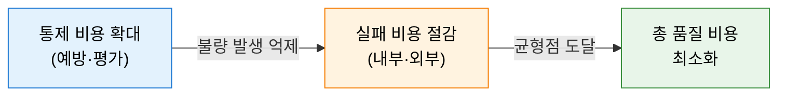
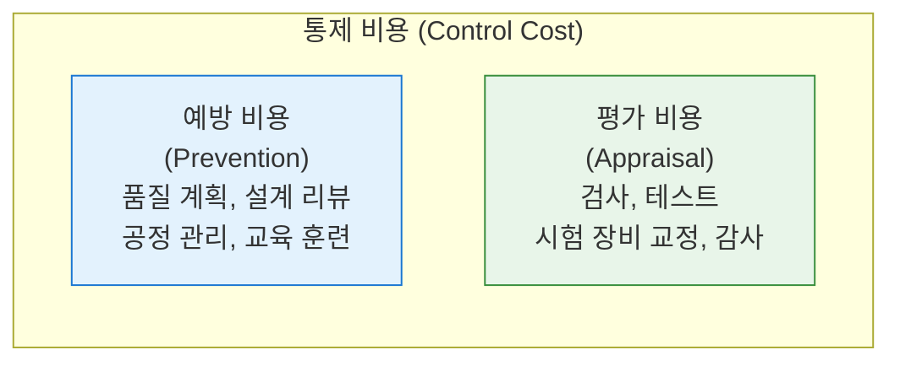
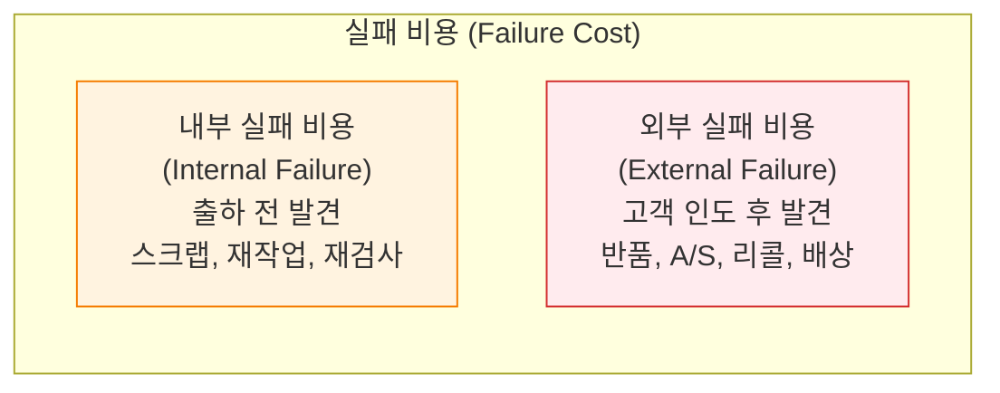

# 품질 비용 (CoQ)
**Cost of Quality**

## 1. 품질 투자와 실패 비용의 최적 균형, 품질 비용(CoQ)의 개요

**개념**: 제품·서비스의 품질 확보를 위해 투입되는 모든 비용(통제 비용)과, 품질 실패로 발생하는 손실(실패 비용)을 체계적으로 분류·정량화하여 총 품질 비용을 최소화하는 품질 경영 분석 모델.

**특징**:
- 품질 비용을 통제 비용(예방·평가)과 실패 비용(내부·외부)으로 이원화하여 분류.
- 예방 투자가 증가할수록 실패 비용이 감소하는 상쇄 관계(Trade-off) 존재.
- 총 품질 비용이 최소화되는 최적 품질 수준(Optimal Quality Point) 도출의 기반 제공.

---

## 2. 품질 비용의 구성 체계 및 분석 모델

### 가. 통제 비용 (Control Costs) — 예방 및 평가

| 구분 | 설명 | 주요 항목 |
|---|---|---|
| **예방 비용** | 불량이 발생하지 않도록 사전에 투자하는 비용 | 품질 계획, 공급업체 평가, 예방적 유지보수, 직원 교육 |
| **평가 비용** | 요구사항 충족 여부를 확인하는 검증 비용 | 입고 검사, 공정 검사, 완제품 테스트, 인증 심사 |

---

### 나. 실패 비용 (Failure Costs) — 내부 및 외부

| 구분 | 설명 | 주요 항목 |
|---|---|---|
| **내부 실패** | 고객 전달 전 발견된 불량 처리 비용 | 불량품 폐기, 재작업, 재검사, 설계 변경 |
| **외부 실패** | 고객 전달 후 발견된 불량 처리 비용 | 반품 처리, 보증 수리, 리콜, 고객 배상, 브랜드 손실 |

---

## 3. 품질 비용 분석의 기대효과 및 활용 방안

| 구분 | 주요 기대효과 | 활용 및 실무 적용 방안 |
|---|---|---|
| **비용 최적화** | 총 품질 비용 최소화 | 예방·평가 비용 증대를 통한 실패 비용 절감 ROI 분석 |
| **투자 근거 확보** | 경영진 설득 수단 | 품질 활동의 재무적 가치 가시화로 투자 승인 근거 제공 |
| **프로세스 개선** | 불량 발생 원인 제거 | 내부 실패 비용 항목 분석을 통한 핵심 개선 과제 도출 |
| **전략적 관리** | 품질-비용 균형 달성 | Six Sigma, TQM과 연계하여 전사적 품질 관리 체계 구축 |
