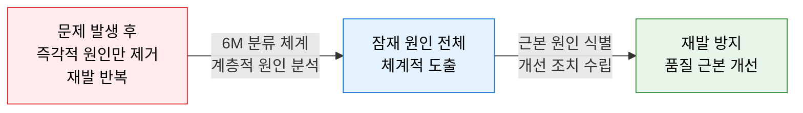
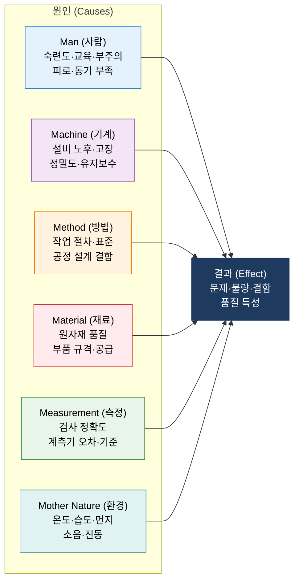
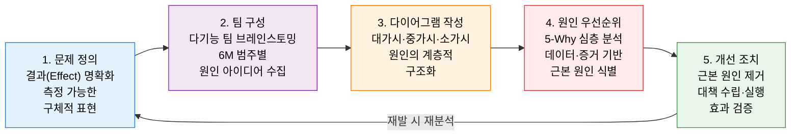

# Fishbone Diagram
**Ishikawa Diagram / Cause-and-Effect Diagram — 특성 요인도**

## 1. 문제의 결과(Effect)에서 출발하여 잠재 원인(Cause)을 체계적으로 도출하는 근본 원인 분석 도구, Fishbone Diagram의 개요

**개념**: 일본 품질 관리의 선구자 이시카와 가오루(石川 馨)가 개발한 품질 분석 도구로, 결과(문제·불량)를 물고기 머리, 잠재 원인 범주를 가시(뼈대)로 표현하여 **6M 분류 체계** 를 통해 문제의 근본 원인을 체계적으로 식별·분석하는 인과 관계 다이어그램.

**특징**:
- **시각적 구조화**: 복잡한 원인-결과 관계를 물고기 뼈 모양의 직관적 다이어그램으로 표현.
- **팀 브레인스토밍** 도구로 다양한 관점의 원인을 빠짐없이 도출하는 데 효과적.
- 5-Why 분석·파레토 차트와 결합하여 **품질 분임조·Six Sigma DMAIC** 의 핵심 분석 도구로 활용.

---

## 2. Fishbone Diagram의 핵심 구성 체계

### 가. 6M 원인 분류 체계

**6M 원인 범주 상세**

| 범주 | 한국어 | 주요 원인 요소 | IT·SW 적용 예시 |
|---|---|---|---|
| **Man** | 사람 | 숙련 부족·교육 미흡·집중력 저하·절차 미준수 | 개발자 코딩 실수·보안 인식 부족 |
| **Machine** | 기계·시스템 | 설비 노후화·오작동·정밀도 저하·유지보수 미흡 | 서버 성능 저하·레거시 시스템 장애 |
| **Method** | 방법·절차 | 표준 부재·비효율 프로세스·잘못된 작업 순서 | 코드 리뷰 미실시·배포 절차 오류 |
| **Material** | 재료·소프트웨어 | 원자재 불량·규격 부적합·공급업체 품질 | 취약한 오픈소스 라이브러리 사용 |
| **Measurement** | 측정·테스트 | 계측 오차·측정 기준 모호·검사 방법 부적절 | 테스트 커버리지 부족·기준값 오설정 |
| **Mother Nature** | 환경 | 온도·습도·분진·소음·네트워크 환경 불안정 | 인프라 환경 불안정·타사 API 장애 |

---

### 나. 근본 원인 분석(RCA) 적용 절차

**5-Why와 결합한 근본 원인 탐색 예시**

| 단계 | 질문 | 답변 |
|---|---|---|
| 문제 | 왜 시스템 장애가 발생했는가? | 데이터베이스 응답이 지연됨 |
| Why 1 | 왜 DB 응답이 지연됐는가? | 특정 쿼리가 전체 테이블을 풀스캔 |
| Why 2 | 왜 풀스캔 쿼리가 실행됐는가? | 인덱스가 없는 컬럼 조건으로 조회 |
| Why 3 | 왜 인덱스가 없었는가? | 개발 단계 성능 검토 절차가 없었음 |
| Why 4 | 왜 성능 검토 절차가 없었는가? | 코드 리뷰 체크리스트에 DB 성능 항목 미포함 |
| **근본 원인** | → **Method(방법)** 범주 — 코드 리뷰 체크리스트 미비 | |

---

## 3. Fishbone Diagram 적용의 기대효과 및 활용 방안

| 구분 | 주요 기대효과 | 활용 및 실무 적용 방안 |
|---|---|---|
| **재발 방지** | 증상이 아닌 근본 원인 제거로 동일 문제 재발 차단 | 장애 후 포스트모텀(Post-mortem)에 Fishbone 분석 의무화 |
| **팀 협업** | 다양한 관점의 원인을 팀 전체가 공유하여 사각지대 제거 | 품질 분임조·스프린트 회고 시 Fishbone 워크숍 활용 |
| **Six Sigma 연계** | DMAIC의 Analyze 단계 핵심 도구로 활용 | 파레토 차트로 상위 원인 선별 후 Fishbone 심층 분석 |
| **SW 품질 개선** | IT 시스템 장애·소프트웨어 결함의 구조적 원인 분석 | 코드 리뷰·테스트·배포 프로세스 개선 과제 도출에 적용 |
