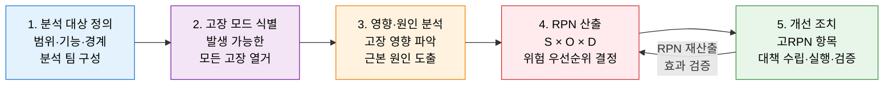
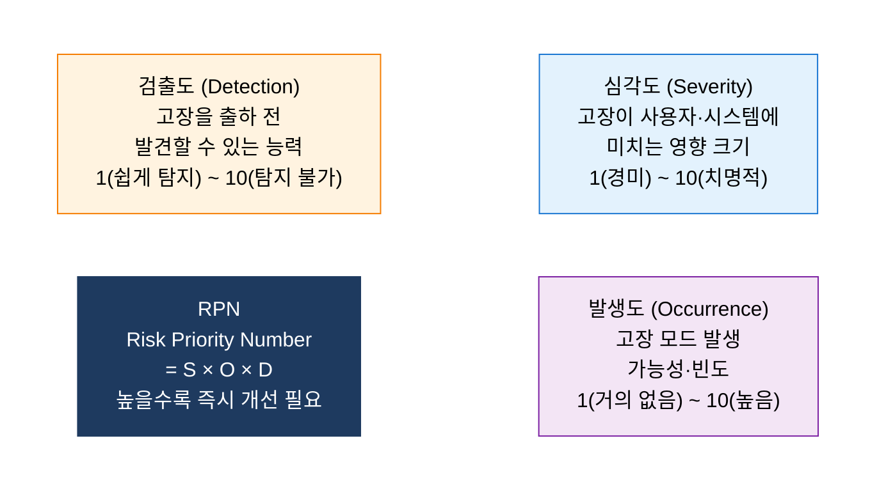

# FMEA
**Failure Mode and Effects Analysis — 잠재 고장 모드 및 영향 분석**

## 1. 잠재 고장을 RPN으로 선제 차단하는 신뢰성 분석 기법, FMEA의 개요

**정의**: 잠재 고장 모드를 사전에 식별하고 RPN(S×O×D)으로 위험도를 정량화하여 선제 예방 대책을 수립하는 품질·신뢰성 분석 기법.
- 분석 대상: 제품 설계·제조 공정·시스템·소프트웨어 전 영역에 적용
- 핵심 산출물: RPN = 심각도(S) × 발생도(O) × 검출도(D) → 고위험 항목 우선 개선
- 적용 시점: 설계·개발 초기 단계에서 수행할수록 수정 비용 최소화(1:10:100 법칙)

**특징**:
- **사전 예방(Proactive)**: 고장이 발생하기 전 설계·프로세스 단계에서 위험 요소를 제거하여 수정 비용을 최소화.
- **정량적 우선순위**: RPN = S × O × D 산식으로 위험 요소의 중요도를 수치화하여 개선 우선순위 객관화.
- **다영역 적용**: 제품 설계(Design FMEA), 제조 공정(Process FMEA), 시스템(System FMEA) 전반에 적용 가능.

---

## 2. FMEA의 핵심 구성 체계

### 가. FMEA 5단계 분석 절차

| 단계 | 주요 활동 | 산출물 |
|---|---|---|
| **1. 분석 대상 정의** | 제품·프로세스 범위 설정, 기능 블록 다이어그램 작성 | 분석 범위 정의서, 기능 목록 |
| **2. 고장 모드 식별** | 각 기능별 잠재 고장 방식 전체 열거 | 고장 모드 목록 |
| **3. 영향·원인 분석** | 고장이 시스템·사용자에 미치는 영향, 근본 원인 분석 | 영향·원인 분석표 |
| **4. RPN 산출** | S·O·D 각 1~10점 평가 후 RPN 계산, 임계값 설정 | FMEA 워크시트 |
| **5. 개선 조치** | 고위험 항목 개선 계획 수립·실행·재평가 | 개선 조치 계획서 |

---

### 나. RPN 산출 및 위험도 관리

**RPN 임계값 기반 조치 기준**

| RPN 범위 | 위험 수준 | 권고 조치 |
|---|---|---|
| **200 이상** | 매우 높음 | 즉시 설계·프로세스 변경 필수 |
| **100~199** | 높음 | 단기 개선 계획 수립 및 실행 |
| **50~99** | 중간 | 개선 방안 검토, 모니터링 강화 |
| **50 미만** | 낮음 | 현 수준 유지, 정기 재검토 |

**FMEA 유형별 적용**

| 유형 | 적용 시점 | 분석 대상 | 주요 활용 |
|---|---|---|---|
| **System FMEA** | 개념 설계 단계 | 시스템 전체 구조 | 시스템 간 인터페이스 위험 분석 |
| **Design FMEA** | 상세 설계 단계 | 부품·컴포넌트 설계 | 설계 취약점 사전 제거 |
| **Process FMEA** | 제조·서비스 프로세스 | 공정·절차 단계 | 공정 결함·변동 원인 예방 |
| **Software FMEA** | SW 설계·개발 단계 | 모듈·기능·인터페이스 | 소프트웨어 결함·장애 예방 |

---

## 3. FMEA 적용의 기대효과 및 활용 방안

| 구분 | 주요 기대효과 | 활용 및 실무 적용 방안 |
|---|---|---|
| **선제적 품질 관리** | 설계·개발 초기 고장 제거로 수정 비용 최소화 (1:10:100 법칙) | 제품 출시 전 Design FMEA로 고위험 설계 요소 사전 제거 |
| **신뢰성·안전성** | RPN 기반 우선순위로 치명적 고장 원인 집중 관리 | 의료기기·자동차·항공 등 안전 필수 시스템의 인증 요건 대응 |
| **프로세스 개선** | Process FMEA로 제조·서비스 공정의 변동 원인 체계적 관리 | 스프린트 착수 전 SW FMEA로 아키텍처·인터페이스 위험 분석 |
| **비용 절감** | 보증·리콜·재작업 비용 감소 및 고객 클레임 사전 차단 | Six Sigma DMAIC의 Analyze 단계와 결합하여 근본 원인 개선 |
