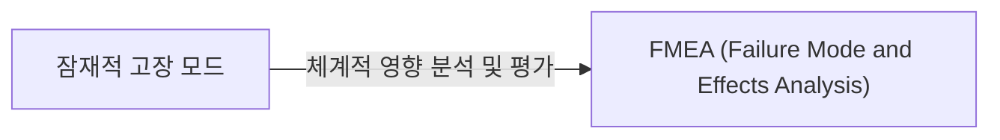

# FMEA (Failure Mode and Effects Analysis)
**잠재 고장 모드 및 영향 분석**

## 1. 잠재적 고장 예측 및 선제적 대응, FMEA의 개요


**개념**: 제품, 서비스 또는 프로세스에서 발생할 수 있는 잠재적인 고장 모드(Failure Mode)를 사전에 식별하고, 그 영향(Effects)을 분석하여 위험도를 평가하고 예방 대책을 수립하는 체계적인 분석 기법.

**특징**: **사전 예방적(Proactive)** 접근 방식, 위험 우선순위 번호(RPN: Risk Priority Number)를 통한 위험도 평가, 잠재적 문제점 해결을 위한 체계적 분석.

---

## 2. FMEA의 분석 절차 및 주요 구성 요소

### 가. FMEA 분석 절차
```mermaid
flowchart TD
    A[분석 대상 정의] --> B(고장 모드 식별);
    B --> C(영향 분석);
    C --> D(원인 분석);
    D --> E{위험도 평가 (RPN)};
    E --> F("대책 수립 및 실행");
    F --> G(결과 검토 및 문서화);
```
1.  **분석 대상 정의**: 분석할 제품, 프로세스, 시스템 또는 서비스의 범위를 명확히 합니다.
2.  **고장 모드 식별**: 대상에서 발생할 수 있는 모든 잠재적 고장 모드를 나열합니다.
3.  **영향 분석 (Effects Analysis)**: 각 고장 모드가 시스템, 사용자, 비즈니스에 미치는 영향을 분석합니다.
4.  **원인 분석 (Cause Analysis)**: 각 고장 모드를 유발할 수 있는 근본 원인을 파악합니다.
5.  **위험도 평가**: 심각도(Severity), 발생 빈도(Occurrence), 검출도(Detection)를 평가하여 RPN(Risk Priority Number)을 산출합니다.
6.  **대책 수립 및 실행**: RPN이 높은 위험 요소에 대한 개선 조치를 계획하고 실행합니다.
7.  **결과 검토 및 문서화**: 조치 결과를 검토하고, 분석 결과를 문서화하여 지속적으로 관리합니다.

### 나. FMEA 주요 구성 요소
| 구성 요소 (영문) | 주요 설명 | 예시 |
|---|---|---|
| **Failure Mode** (고장 모드) | 예상되는 고장, 오류, 결함 또는 설계상의 문제점 | 소프트웨어 충돌, 부품 고장 |
| **Effect** (영향) | 고장 모드가 발생했을 때 초래되는 결과 | 서비스 중단, 데이터 손실, 안전 문제 |
| **Cause** (원인) | 고장 모드를 유발하는 근본적인 이유 | 설계 결함, 제조 오류, 운영 실수 |
| **Severity (S)** (심각도) | 고장의 영향이 얼마나 심각한지 측정 (1-10) | 높은 S 값은 즉각적인 조치 필요 |
| **Occurrence (O)** (발생 빈도) | 고장 모드가 발생할 확률/빈도 측정 (1-10) | 낮은 O 값은 발생 가능성이 낮음 |
| **Detection (D)** (검출도) | 고장 모드나 원인이 발생했을 때 이를 감지할 수 있는 능력 (1-10) | 낮은 D 값은 감지가 어려움 (높은 위험) |
| **RPN** (Risk Priority Number) | S x O x D 값. 위험 우선순위 결정에 사용 | 높은 RPN은 높은 우선순위로 조치 필요 |

---

## 3. FMEA 기대효과 및 활용 방안

| 항목 | 기대효과 | 활용 방안 |
|---|---|---|
| **선제적 위험 관리** | 잠재적 고장 모드를 사전에 식별하여 개발/프로세스 초기 단계에서 수정 | 제품 설계, 제조 공정, 서비스 개발 초기 단계 |
| **품질 및 신뢰성 향상** | 제품/서비스의 실패 가능성 감소 및 신뢰성 증대 | 신제품 개발, 공정 개선, 안전 관련 시스템 설계 |
| **비용 절감** | 고장으로 인한 재작업, 수리, 보증 비용 감소 | 개발 및 운영 단계의 잠재적 비용 손실 최소화 |
| **고객 만족도 증대** | 안정적인 제품/서비스 제공을 통한 고객 만족도 향상 | 사용자 경험 개선 및 브랜드 신뢰도 제고 |
