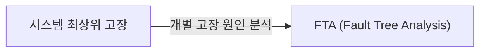
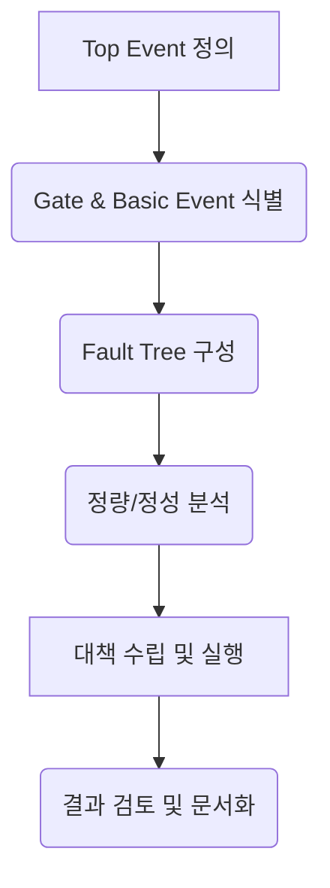

# FTA (Fault Tree Analysis)
**결함 트리 분석**

## 1. 시스템 고장의 근본 원인을 찾는, FTA의 개요

**정의**: 시스템이나 부품의 특정 고장(Top Event)이 발생할 확률을 계산하기 위해, 그 고장을 일으킬 수 있는 모든 잠재적 원인들을 논리 게이트(AND, OR)로 연결하여 분석하는 연역적(Deductive) 방법론.

**특징**: 발생 가능한 모든 실패 시나리오를 체계적으로 분석, 복잡한 시스템의 잠재적 위험 요소 식별 및 완화 대책 수립에 효과적.

---

## 2. FTA의 분석 절차 및 주요 구성 요소

### 가. FTA 분석 절차

1.  **Top Event 정의**: 분석 대상이 되는 시스템의 치명적 고장이나 실패 시나리오를 명확히 정의합니다.
2.  **Gate 및 Basic Event 식별**: Top Event를 발생시킬 수 있는 하위 이벤트들을 식별하고, 논리 게이트(AND, OR 등)를 사용하여 이들 간의 관계를 정의합니다.
3.  **Fault Tree 구성**: Top Event에서 시작하여 Basic Event까지 역으로 추적하며 트리 구조를 완성합니다.
4.  **정량/정성 분석**: 식별된 이벤트의 발생 확률을 기반으로 Top Event 발생 확률을 계산하거나, 중요한 실패 경로를 식별합니다.
5.  **개선 방안 도출**: 분석 결과를 바탕으로 고장 발생 가능성이 높은 부분에 대한 개선 또는 예방 대책을 수립합니다.

### 나. FTA 주요 구성 요소
*   **Top Event (최상위 사상)**: 분석 대상이 되는 시스템의 바람직하지 않은 사건 (예: 제어 시스템 실패, 데이터 유출).
*   **Basic Event (기본 사상)**: 더 이상 분해되지 않는 기본적인 고장 원인 (예: 부품 고장, 인간 오류).
*   **Intermediate Event (중간 사상)**: 여러 Basic Event 또는 Intermediate Event의 조합으로 발생하는 복합적인 고장.
*   **Gates (논리 연산자)**:
    *   **AND Gate**: 모든 입력 조건이 충족될 때 출력을 발생시킵니다. (예: 두 개의 부품이 동시에 고장 나야 시스템 고장)
    *   **OR Gate**: 입력 조건 중 하나라도 충족되면 출력을 발생시킵니다. (예: 여러 원인 중 하나라도 발생하면 시스템 고장)
*   **Fault Tree**: Top Event에서 시작하여 Basic Event로 하향하는 트리 구조.

---

## 3. FTA 기대효과 및 활용 방안

*   **기대효과**:
    *   시스템의 잠재적 고장 및 위험 요소 조기 식별
    *   복잡한 시스템의 안전성 및 신뢰성 향상
    *   비용 효율적인 위험 완화 및 예방 전략 수립 지원
    *   안전 규제 준수 및 표준 충족
*   **활용 방안**:
    *   항공우주, 원자력, 화학 등 고위험 산업 분야의 시스템 안전 분석
    *   소프트웨어 시스템의 잠재적 결함 및 보안 취약점 분석
    *   FMEA (Failure Mode and Effects Analysis)와 함께 사용하여 보다 심층적인 위험 평가 수행
