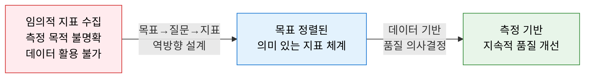
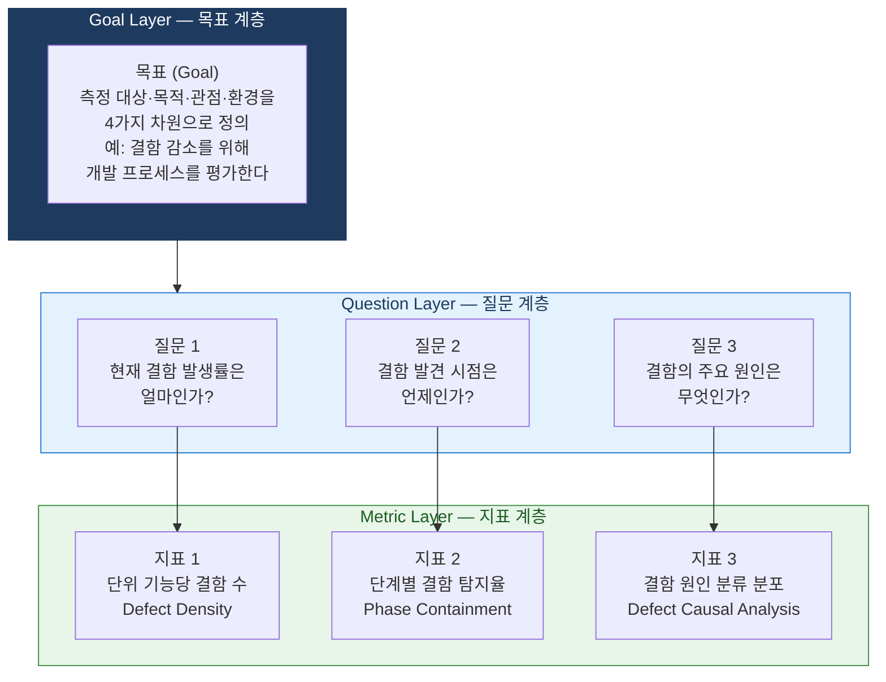
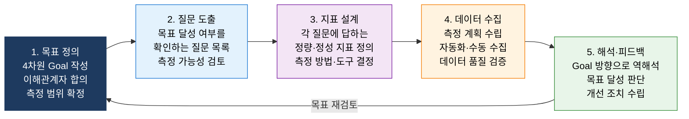

# GQM
**Goal-Question-Metric — 목표 기반 소프트웨어 측정 프레임워크**

## 1. 목표 정의 후 질문·지표를 역방향 도출하는 SW 품질 측정 프레임워크, GQM의 개요

**정의**: Victor Basili가 개발한 소프트웨어 측정 프레임워크로, **목표(Goal)→질문(Question)→지표(Metric)** 의 3계층 하향식 접근으로 측정 목적과 직결된 의미 있는 품질 지표를 도출하고, 수집된 데이터를 역방향으로 해석하여 목표 달성 여부를 평가하는 체계적 측정 전략.

**특징**:  
 **(Top-Down 설계)** 지표를 먼저 정하는 것이 아닌 측정 **목표를 먼저 정의** 하고 필요한 지표를 역방향으로 도출.  
 **(맥락 의존성)** 동일한 지표라도 측정 목표·관점·환경에 따라 해석이 달라짐 — 맥락을 항상 명시.  
 **(표준 연계)** ISO/IEC 15939(소프트웨어 측정 표준)·CMMI·Six Sigma DMAIC의 Measure 단계와 연계.  

---

## 2. GQM의 핵심 구성 체계

### 가. Goal-Question-Metric 3계층 구조

**목표(Goal) 정의 4가지 차원**

| 차원 | 설명 | 예시 |
|---|---|---|
| **Object (대상)** | 무엇을 측정할 것인가 | 소프트웨어 개발 프로세스·제품·자원 |
| **Purpose (목적)** | 왜 측정하는가 | 이해·개선·예측·통제·변경 |
| **Quality Focus (품질 관점)** | 어떤 품질 속성을 본는가 | 결함·생산성·비용·신뢰성·유지보수성 |
| **Viewpoint (관점)** | 누구의 시각인가 | 개발자·관리자·사용자·품질 담당자 |

---

### 나. SW 품질 지표 설계 및 측정 절차

**SW 품질 GQM 적용 예시**

| 목표 (Goal) | 질문 (Question) | 지표 (Metric) |
|---|---|---|
| **결함 감소를 위해 코드 품질을 평가** | 코드의 복잡도 수준은? | Cyclomatic Complexity |
| | 코드 리뷰 커버리지는? | 리뷰 완료 PR 비율 (%) |
| | 정적 분석 위반 건수는? | SAST 경고 건수/1,000 LOC |
| **생산성 향상을 위해 개발 프로세스를 분석** | 기능당 개발 소요 시간은? | Function Point당 공수 |
| | 배포 주기는 얼마나 되는가? | 배포 빈도 (회/주) |
| | 재작업 비율은 얼마인가? | 재작업 공수/전체 공수 (%) |

---

## 3. GQM 적용의 기대효과 및 활용 방안

| 구분 | 주요 기대효과 | 활용 및 실무 적용 방안 |
|---|---|---|
| **목표 정렬 측정** | 조직 목표와 직결된 의미 있는 지표만 수집·분석 | 불필요한 지표 제거 — "수집 가능"이 아닌 "필요한" 지표 선정 |
| **품질 가시화** | 소프트웨어 품질 현황을 데이터로 객관적 표현 | 스프린트 리뷰·QBR에 GQM 지표 대시보드 활용 |
| **CMMI 연계** | 측정 및 분석(MA) 프로세스 영역의 핵심 구현 방법 | CMMI Level 4 달성을 위한 정량적 측정 체계 수립 |
| **DevOps 지표** | DORA 4가지 핵심 지표를 GQM 프레임으로 구조화 | 배포 빈도·리드 타임·변경 실패율·MTTR 측정 목표 정의 |
