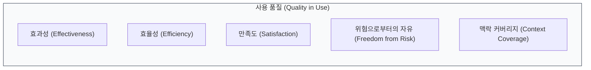

# ISO/IEC 25010
**System and Software Quality Models**

## 1. 소프트웨어 품질 평가의 표준, ISO/IEC 25010의 개요

**개념**: 소프트웨어 제품의 품질을 평가하기 위해 품질 특성(Characteristics)과 부특성(Sub-characteristics)을 정의한 국제 표준(ISO/IEC 9126의 후속).

**특징**: **제품 품질 모델**과 **사용 품질 모델**로 이원화하여 관리, 객관적이고 정량적인 품질 측정을 위한 지표 제공.

---

## 2. ISO/IEC 25010의 8대 제품 품질 특성

### 가. 제품 품질 모델 (Product Quality Model)

```mermaid
flowchart TD
  ISO25010n --> FunctionalSuitability[기능 적합성 (Functional Suitability)]
  ISO25010n --> PerformanceEfficiency[성능 효율성 (Performance Efficiency)]
  ISO25010n --> Compatibility[호환성 (Compatibility)]
  ISO25010n --> Usability[사용성 (Usability)]
  ISO25010n --> Reliability[신뢰성 (Reliability)]
  ISO25010n --> Security[보안성 (Security)]
  ISO25010n --> Maintainability[유지보수성 (Maintainability)]
  ISO25010n --> Portability[이식성 (Portability)]
```

| 주요 특성 | 상세 설명 | 주요 부특성 예시 |
|---|---|---|
| **기능 적합성** | 명시된 요구사항을 얼마나 충족하는가 | 기능 완전성, 기능 정확성 |
| **성능 효율성** | 자원 사용 대비 성능 수준은 어떠한가 | 시간 반응성, 자원 효율성 |
| **사용성** | 사용자가 얼마나 쉽고 편하게 사용하는가 | 학습 용이성, 운영성, 사용자 오류 방지 |
| **신뢰성** | 특정 조건 및 기간 동안 성능을 유지하는가 | 성숙도, 가용성, 결함 허용성 |
| **보안성** | 정보 및 데이터를 안전하게 보호하는가 | 기밀성, 무결성, 부인 방지, 책임성 |
| **유지보수성** | 제품 수정 및 개선이 얼마나 용이한가 | 모듈성, 재사용성, 분석성, 테스트 용이성 |

---

### 나. 사용 품질 모델 (Quality in Use Model)



| 특성 | 설명 | 비고 |
|---|---|---|
| **효과성** | 사용자가 특정 목표를 정확하고 완전하게 달성하는 정도 | 결과물 중심 |
| **효율성** | 목표 달성을 위해 소비된 자원 대비 정확도 | 과정의 경제성 |
| **만족도** | 사용자의 요구가 충족된 정도 | 심리적 만족 포함 |
| **위험 자유** | 경제, 건강, 안전, 환경적 위험을 최소화하는 정도 | 리스크 관리 |

---

## 3. ISO/IEC 25010 도입의 기대효과 및 활용 방안

| 구분 | 주요 기대효과 | 활용 및 실무 적용 방안 |
|---|---|---|
| **요구사항 정의** | 명확한 품질 요구사항 도출 | RFP(제안요청서) 작성 시 품질 지표의 기준으로 활용 |
| **품질 검증** | 객관적인 소프트웨어 시험 및 평가 | V&V(Validation & Verification) 단계의 테스트 케이스 설계 기준 |
| **의사소통** | 이해관계자 간 공통 언어 확보 | 개발자, 사용자, QA 간의 품질 목표 합의 및 협의 도구 |
| **프로세스 개선** | 품질 중심의 개발 생애주기 관리 | 발견된 품질 결함 분석을 통해 개발 프로세스 보완 및 고도화 |
