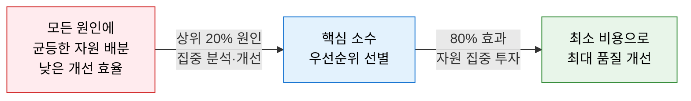
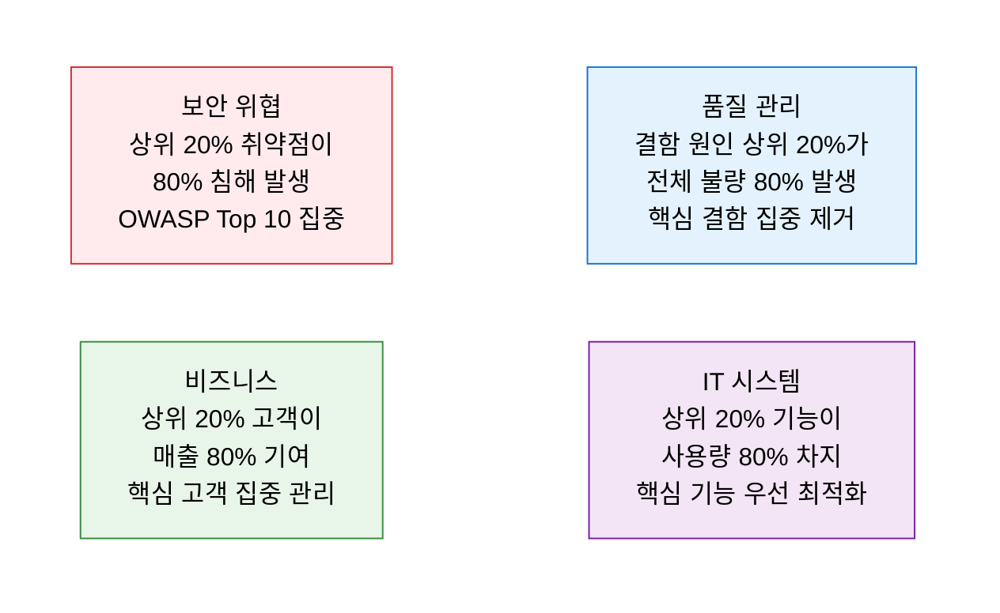
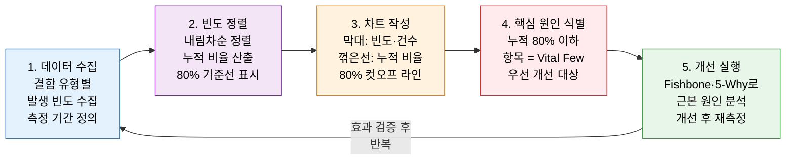

# Pareto Principle
**파레토 법칙 / 80-20 법칙 — 소수 원인이 대다수 결과를 지배한다**

## 1. 전체 결과의 80%는 20%의 원인에서 비롯된다는 불균형 법칙으로 자원 배분 우선순위를 결정하는 원칙, 파레토 법칙의 개요

**개념**: 이탈리아 경제학자 빌프레도 파레토(Vilfredo Pareto)가 발견한 법칙으로, **전체 결과의 80%는 전체 원인의 20%에서 발생**한다는 불균형 분포 원리. 품질 관리에서는 소수의 핵심 결함 원인이 전체 불량의 대부분을 차지한다는 사실을 기반으로 개선 우선순위를 결정하는 데 활용.

**특징**:
- **핵심 소수(Vital Few) vs 유용한 다수(Useful Many)**: 전체 중 핵심이 되는 소수 요인을 식별하여 집중.
- 파레토 차트(막대 그래프 + 누적 꺾은선 그래프)를 통해 원인별 영향도를 **시각적으로 순위화**.
- Six Sigma DMAIC·ISO 9001·TQM의 핵심 분석 도구 — Fishbone Diagram·5-Why와 함께 활용.

---

## 2. 파레토 법칙의 핵심 구성 체계

### 가. 80/20 법칙의 원리 및 응용

**파레토 법칙 적용 분야**

| 분야 | 80% 결과 | 20% 원인 | 집중 전략 |
|---|---|---|---|
| **SW 품질** | 전체 버그 80% | 결함 유형 상위 20% | 핵심 결함 유형 코드 리뷰 집중 |
| **IT 보안** | 보안 사고 80% | 취약점 상위 20% | OWASP Top 10·고위험 취약점 우선 패치 |
| **시스템 성능** | 응답 지연 80% | 쿼리·API 상위 20% | 슬로우 쿼리 최적화·캐싱 집중 |
| **고객 지원** | 티켓 80% | 문의 유형 상위 20% | FAQ·자동화로 반복 문의 일괄 해결 |
| **프로젝트 관리** | 리스크 80% | 위험 요인 상위 20% | 최우선 리스크 집중 모니터링·대응 |

---

### 나. 파레토 차트 작성 및 품질 개선 적용

**파레토 차트 구성 요소**

| 구성 요소 | 설명 | 해석 방법 |
|---|---|---|
| **X축 (원인 범주)** | 결함 유형·원인·항목을 빈도 내림차순 배열 | 왼쪽이 가장 빈도 높은 핵심 원인 |
| **Y축 왼쪽 (빈도)** | 각 원인의 발생 건수·비율 | 막대 높이로 개별 기여도 파악 |
| **Y축 오른쪽 (누적 %)** | 왼쪽부터 누적된 비율 (0%→100%) | 꺾은선 기울기가 급격할수록 핵심 |
| **80% 기준선** | 누적 비율 80% 지점의 수평선 | 기준선 왼쪽 = Vital Few (집중 대상) |

**SW 결함 파레토 분석 예시**

| 순위 | 결함 유형 | 발생 건수 | 비율 | 누적 비율 |
|---|---|---|---|---|
| 1 | 입력 유효성 검증 미흡 | 45건 | 36% | 36% |
| 2 | NULL 포인터 참조 오류 | 28건 | 22% | 58% |
| 3 | 예외 처리 누락 | 18건 | 14% | **72%** |
| 4 | 동시성 처리 오류 | 12건 | 10% | 82% |
| 5 | 기타 | 22건 | 18% | 100% |
| **→ Vital Few (1~3위)** | **핵심 3개 유형** | **91건** | **72%** | **집중 개선 대상** |

---

## 3. 파레토 법칙 적용의 기대효과 및 활용 방안

| 구분 | 주요 기대효과 | 활용 및 실무 적용 방안 |
|---|---|---|
| **자원 집중** | 제한된 자원을 최대 효과 영역에 집중 배분 | 스프린트 리소스를 상위 20% 결함 유형 해결에 우선 투입 |
| **품질 개선 효율** | 핵심 원인 제거로 전체 불량의 80% 해결 | 월간 결함 파레토 분석으로 반복 발생 패턴 식별·제거 |
| **의사결정 근거** | 데이터 기반의 명확한 우선순위 제시 | 보안 패치 우선순위 결정 시 취약점 심각도 파레토 적용 |
| **Six Sigma 연계** | DMAIC Analyze 단계에서 Fishbone·5-Why와 결합 | 파레토로 핵심 원인 선별 → Fishbone으로 근본 원인 심층 분석 |
