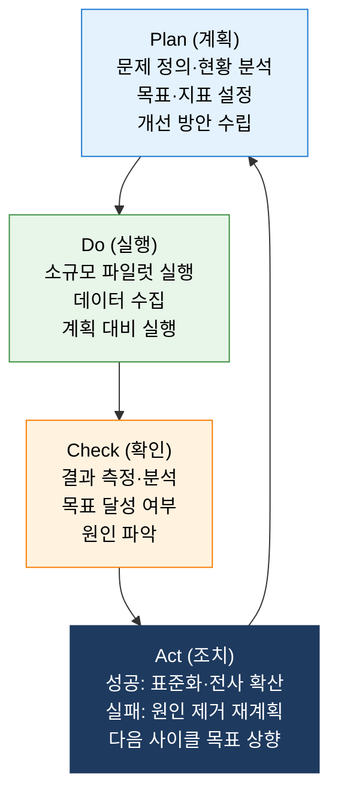
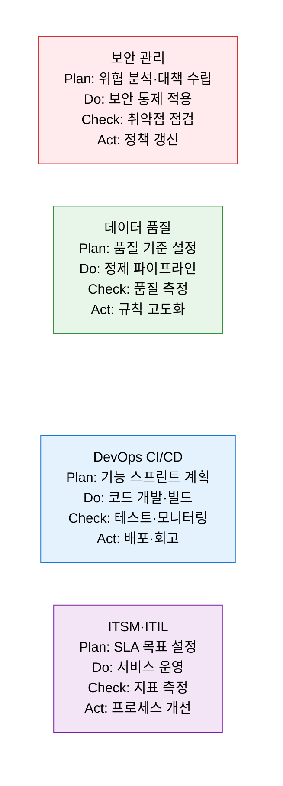

# PDCA
**Plan-Do-Check-Act — 지속적 개선의 보편적 순환 사이클**

## 1. 계획-실행-확인-조치의 4단계 순환으로 프로세스·품질·성과를 지속적으로 개선하는 경영 방법론, PDCA의 개요

**개념**: Walter Shewhart가 고안하고 W. Edwards Deming이 보급한 품질 관리 방법론으로, **Plan(계획)→Do(실행)→Check(확인)→Act(조치)** 의 4단계를 반복 순환함으로써 프로세스·제품·서비스의 품질을 지속적으로 개선하는 보편적 개선 사이클.

**특징**:
- **반복적 나선형 개선**: 한 사이클 완료 후 더 높은 수준에서 다시 시작 — 끊임없는 향상(Kaizen).
- **소규모 파일럿 우선**: Do 단계에서 전체 도입 전 작은 규모로 실험·검증하여 위험 최소화.
- TQM·ISO 9001·ITIL·Lean·Six Sigma·ISO 27001 등 **모든 주요 품질·관리 표준의 공통 기반**.

---

## 2. PDCA의 핵심 구성 체계

### 가. 4단계 개선 사이클 구조

**단계별 핵심 활동 및 도구**

| 단계 | 핵심 질문 | 주요 활동 | 활용 도구 |
|---|---|---|---|
| **Plan** | 무엇이 문제인가? 어떻게 개선할 것인가? | 현황 데이터 수집·분석, 목표·KPI 설정, 개선 계획 수립 | 파레토 차트, Fishbone, 5-Why, 가설 설정 |
| **Do** | 계획대로 실행하고 있는가? | 소규모 파일럿 실행, 데이터 수집, 변수 통제 | 체크시트, 실험 로그, 관찰 기록 |
| **Check** | 결과가 계획과 일치하는가? | 목표 대비 실적 비교, 편차 분석, 성공·실패 요인 규명 | 관리도, 히스토그램, 산점도, 대시보드 |
| **Act** | 개선사항을 어떻게 정착시킬 것인가? | 성공 시 표준화·전사 확산, 실패 시 재계획 후 재반복 | SOP 문서화, 교육 훈련, 다음 Plan 목표 설정 |

**PDCA vs DMAIC 비교**

| 비교 항목 | PDCA | DMAIC (Six Sigma) |
|---|---|---|
| **기원** | Shewhart·Deming (1950년대) | Motorola·GE (1980~90년대) |
| **접근** | 간단·빠른 반복 개선 | 복잡한 문제의 심층 통계 분석 |
| **데이터** | 기본 데이터 분석 중심 | 정밀한 통계 도구 활용 |
| **적합 상황** | 일상적·반복적 프로세스 개선 | 대규모·복잡한 품질 문제 해결 |
| **소요 기간** | 단기~중기 (주~월 단위) | 중장기 (월~분기 단위) |
| **상호 보완** | PDCA 사이클 안에서 DMAIC 방법론 적용 가능 ||

---

### 나. IT 서비스·프로세스 개선 적용

**IT 프로젝트 PDCA 적용 예시 — 시스템 장애 감소**

| 단계 | 활동 | 결과 |
|---|---|---|
| **Plan** | 월 평균 장애 12건 → 목표 6건 이하로 감소 계획 수립 | 장애 유형 파레토 분석: DB 연결 오류 40% 차지 확인 |
| **Do** | DB 커넥션 풀 설정 최적화 + 자동 재시작 스크립트 배포 | 파일럿 2주 운영, 장애 발생 로그 수집 |
| **Check** | 2주 후 DB 연결 오류 75% 감소, 전체 장애 9건으로 감소 | 목표 달성 미흡(6건 미달), 잔여 원인: 메모리 부족 |
| **Act** | DB 설정 변경 표준화·전 서버 적용, 메모리 이슈를 다음 Plan으로 | 새 목표: 메모리 관리 정책 수립 → 다음 PDCA 시작 |

---

## 3. PDCA 적용의 기대효과 및 활용 방안

| 구분 | 주요 기대효과 | 활용 및 실무 적용 방안 |
|---|---|---|
| **지속적 개선** | 문제 해결 후 더 높은 목표로 나선형 성과 향상 | 스프린트 회고를 PDCA 구조로 운영하여 팀 프로세스 지속 개선 |
| **리스크 최소화** | 소규모 Do 단계 실험으로 전사 적용 전 리스크 검증 | 신기술 도입 시 파일럿 → 검증 → 전사 확산 순서 적용 |
| **표준화** | 성공한 개선 사항을 Act 단계에서 즉시 SOP로 문서화 | 장애 해결 조치를 런북(Runbook)으로 즉시 표준화 |
| **문화 정착** | 반복 적용으로 데이터 기반 개선 문화 전사 내재화 | ISO 9001·ITIL·ISMS-P의 지속 개선 요건을 PDCA로 통합 이행 |
