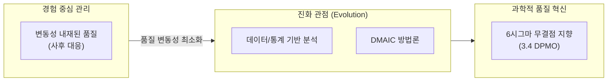
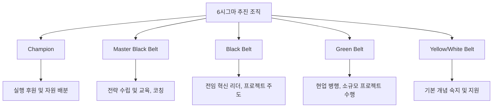

# Six Sigma
**Six Sigma & DMAIC Methodology**

## 1. 무결점을 지향하는 품질 혁신, 6시그마의 개요

**정의**: 모든 프로세스에서 발생하는 변동성을 최소화하여 100만 개당 3.4개(3.4 DPMO) 이하의 결함률을 목표로 하는 데이터 기반의 품질 개선 방법론.

**특징**:  
 **(통계적 분석)** 데이터와 통계 도구(DMAIC)로 품질 문제를 과학적으로 분석하고 원인을 정확히 규명.  
 **(CTQ 중심)** 고객 관점의 핵심 품질 요구사항(CTQ: Critical To Quality)을 정의하여 개선 방향을 설정.  
 **(벨트 제도)** GB·BB·MBB 벨트 제도로 6시그마 전문가를 양성하여 조직 내 실행 역량을 체계적으로 확보.  

---

## 2. 6시그마의 추진 방법론 및 핵심 도구

### 가. 개선 프로세스 (DMAIC 모델 - 진화 관점)

| 단계 | 주요 활동 내용 | 핵심 도구 (Tool) |
|---|---|---|
| **Define** | 프로젝트 헌장 작성, 고객 요구사항(VOC) 수립 | SIPOC, CTQ Tree, 파레토 차트 |
| **Measure** | 데이터 수집 계획, 공정 능력(Cp/Cpk) 분석 | 히스토그램, 런 차트, 게이지 R&R |
| **Analyze** | 데이터 기반 가설 설정 및 유의성 검증 | 상관 분석, 회귀 분석, Ishikawa Diagram |
| **Improve** | 해결책 도출 및 시뮬레이션, Pilot 테스트 | DOE (실험계획법), FMEA |
| **Control** | 표준화, 문서화, 성과 모니터링 및 이관 | SPC (통계적 공정 관리), 관리도 |

---

### 나. 6시그마 추진 조직 및 역량 체계 (Belts)

---

## 3. 6시그마 도입의 기대효과 및 실무 적용 방안

| 구분 | 주요 기대효과 | 활용 및 실무 적용 방안 |
|---|---|---|
| **비용 절감** | 실패 비용(COPQ)의 획기적 감소 | 불량률 감소 및 재작업 최소화를 통한 제조/서비스 원가 절감 |
| **프로세스 최적화** | 변동성 제거를 통한 예측 가능성 증대 | 데이터 기반의 정량적 분석으로 주관적 판단 배제 및 프로세스 표준화 |
| **고객 만족** | 핵심 품질 요소(CTQ) 만족도 제고 | 고객 요구사항과 직결된 지표를 개선하여 비즈니스 가치 극대화 |
| **문화 확산** | 과학적/논리적 문제 해결 문화 정착 | 벨트 제도를 활용한 인재 양성 및 조직 전반의 데이터 문해력 향상 |
