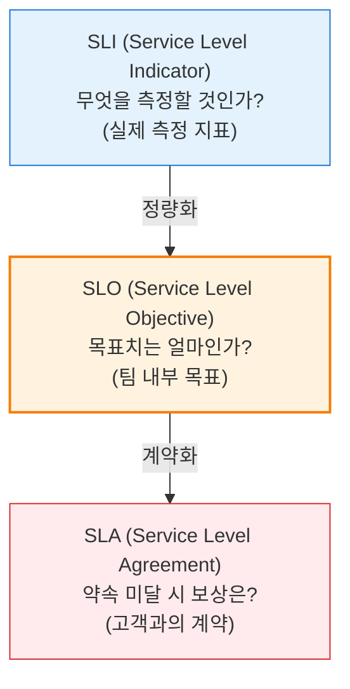
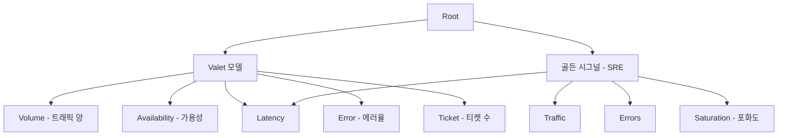

# SLA / SLO / SLI
**Service Level Management Metrics**

## 1. 정량적 서비스 수준 관리의 핵심, SLI/SLO/SLA의 개요

**개념**: 서비스의 성능과 신뢰성을 객관적인 지표로 측정하고(SLI), 달성하고자 하는 목표치를 설정하며(SLO), 미달 시의 약속을 정의하는(SLA) 통합 관리 체계.

**특징**: IT 서비스 제공자와 사용자 간의 기대치를 일치시키고, **에러 예산(Error Budget)** 활용을 통해 개발 속도와 안정성의 균형을 유지.

---

## 2. 서비스 수준 관리의 구성 요소 및 메커니즘

### 가. 서비스 지표 관리 모델 (Indicator to Agreement)

| 구분 | 정의 | 예시 |
|---|---|---|
| **SLI** | 서비스 수준을 측정하는 정량적 척도 | 지연 시간(Latency), 가용성(Availability), 처리량 |
| **SLO** | 서비스 수준에 대해 합의된 목표 수치 | 가용성 99.9% 이상, 응답 속도 200ms 이하 |
| **SLA** | SLO 미달 시 발생하는 재무적/법적 책임 | 서비스 요금 환불, 크레딧 제공, 계약 해지권 |

---

### 나. SLI 도출을 위한 Valet 모델 및 골든 시그널

| 지표 유형 | 주요 측정 항목 | 비고 |
|---|---|---|
| **가용성 (Availability)** | 전체 요청 중 성공한 요청의 비율 | 서비스 생존 여부 확인 |
| **지연 시간 (Latency)** | 서비스 요청 처리 소요 시간 | 사용자 경험(UX) 직결 |
| **에러율 (Errors)** | 명시적/암시적 에러 발생 빈도 | 시스템 무결성 확인 |
| **포화도 (Saturation)** | 리소스의 사용량 대비 한계치 | 확장성(Scalability) 판단 근거 |

---

## 3. SLA / SLO / SLI 활용의 기대효과 및 실무 전략

| 구분 | 주요 기대효과 | 활용 및 실무 적용 방안 |
|---|---|---|
| **의사결정 표준** | 에러 예산(Error Budget) 활용 | SLO 달성 여부에 따라 신규 기능 배포 여부 결정 |
| **투명성 확보** | 서비스 신뢰도 가시화 | 실시간 대시보드(Grafana 등)를 통한 상태 공유 |
| **R&R 명확화** | 제공자-사용자 간 책임 정의 | 장애 발생 시 대응 우선순위 및 복구 목표 시간(RTO) 설정 |
| **지속적 개선** | 데이터 기반의 서비스 고도화 | 주기적인 SLO 검토를 통해 과도하거나 부족한 인프라 최적화 |
