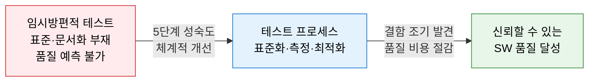
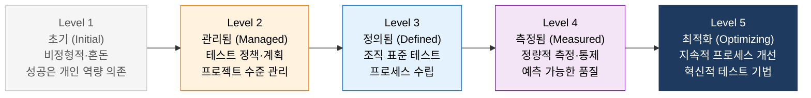
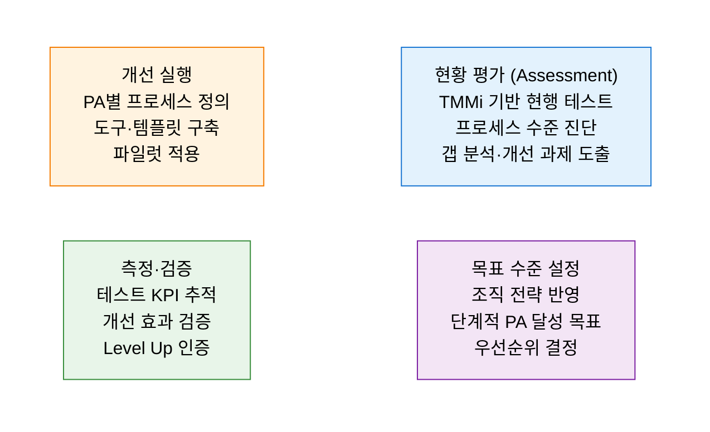

# TMMi
**Test Maturity Model Integration — 테스트 프로세스 성숙도 모델**

## 1. 테스트 프로세스의 현재 수준을 진단하고 5단계 성숙도 목표를 향해 체계적으로 개선하는 프레임워크, TMMi의 개요

**개념**: TMMi Foundation이 CMMI를 기반으로 개발한 테스트 전문 성숙도 모델로, 소프트웨어 테스트 프로세스를 **5단계 성숙도 수준** 과 각 수준별 **프로세스 영역(PA)** 으로 구조화하여 조직의 현행 테스트 역량을 진단하고 단계적 개선 로드맵을 제시하는 프레임워크.

**특징**:
- CMMI의 **단계적(Staged) 표현** 방식 채택 — Level 1~5의 순차적 성숙도 향상.
- 테스트 정책·전략·계획·설계·실행·측정·최적화 전 영역을 구조적으로 포괄.
- ISO 29119(소프트웨어 테스트 표준)·ISTQB와 상호 보완적으로 활용 가능.

---

## 2. TMMi의 핵심 구성 체계

### 가. 5단계 성숙도 모델 구조

**단계별 프로세스 영역(PA) 및 달성 기준**

| 수준 | 명칭 | 프로세스 영역 | 핵심 달성 기준 |
|---|---|---|---|
| **Level 1** | Initial | 없음 (특정 PA 없음) | 테스트가 임시방편적으로 수행 |
| **Level 2** | Managed | 테스트 정책·전략, 테스트 계획, 테스트 모니터링·통제, 테스트 설계·실행, 테스트 환경 | 프로젝트별 테스트 계획 수립 및 실행 |
| **Level 3** | Defined | 조직 테스트 프로세스, 테스트 훈련 프로그램, 조직 테스트 자산 관리, 피어 리뷰 | 전사 표준 테스트 프로세스 정의 및 적용 |
| **Level 4** | Measured | 테스트 측정, 제품 품질 평가, 고급 리뷰 | 테스트 KPI 기반 정량적 품질 관리 |
| **Level 5** | Optimizing | 결함 방지, 품질 통제 최적화, 테스트 프로세스 최적화 | 테스트 프로세스 지속적 혁신·자동화 |

---

### 나. 테스트 프로세스 개선 적용

**TMMi Level 2 핵심 테스트 프로세스 (실무 적용 출발점)**

| 프로세스 영역 | 주요 활동 | 산출물 |
|---|---|---|
| **테스트 정책·전략** | 조직 전체 테스트 방향·원칙·접근법 정의 | 테스트 정책서, 테스트 전략서 |
| **테스트 계획** | 범위·일정·자원·위험·종료 기준 계획 수립 | 마스터 테스트 계획서(MTP) |
| **테스트 모니터링·통제** | 진행 현황 추적, 편차 발생 시 시정 조치 | 테스트 진척 보고서, 결함 보고서 |
| **테스트 설계·실행** | 테스트 케이스 설계·실행·결과 기록 | 테스트 케이스, 테스트 결과서 |
| **테스트 환경** | 테스트 환경 구축·유지·관리 | 환경 구성 계획서, 환경 상태 보고 |

**CMMI vs TMMi 비교**

| 비교 항목 | CMMI | TMMi |
|---|---|---|
| **초점** | 전체 SW 개발 프로세스 성숙도 | 테스트 프로세스 특화 성숙도 |
| **단계 수** | 5단계 (Level 1~5) | 5단계 (Level 1~5) |
| **프로세스 영역** | 22개 PA (전체 개발) | 16개 PA (테스트 전문) |
| **적용 대상** | 개발 조직 전체 | 테스트 팀·QA 조직 |
| **상호 관계** | TMMi Level은 CMMI Level 2 이상 달성 후 병행 추진 권장 ||

---

## 3. TMMi 도입의 기대효과 및 활용 방안

| 구분 | 주요 기대효과 | 활용 및 실무 적용 방안 |
|---|---|---|
| **품질 가시화** | 테스트 프로세스 성숙도를 정량적·객관적으로 측정 | 연 1회 TMMi 자가 평가로 테스트 역량 수준 추이 추적 |
| **결함 조기 발견** | 표준화된 테스트로 개발 초기 단계 결함 발견 비율 향상 | Level 2 달성으로 테스트 계획·리뷰 프로세스 표준화 |
| **DevOps 연계** | 자동화·CI/CD 통합 테스트 체계로 Level 4~5 역량 확보 | 테스트 자동화 도입을 TMMi Level 5 최적화 목표와 연계 |
| **발주·감리 활용** | 공공·금융 프로젝트 테스트 수준 증빙 자료로 활용 | TMMi 평가 결과를 SW 품질 감리 보고서에 반영 |
