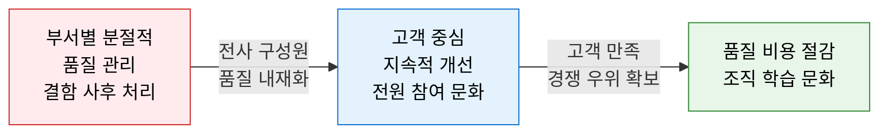
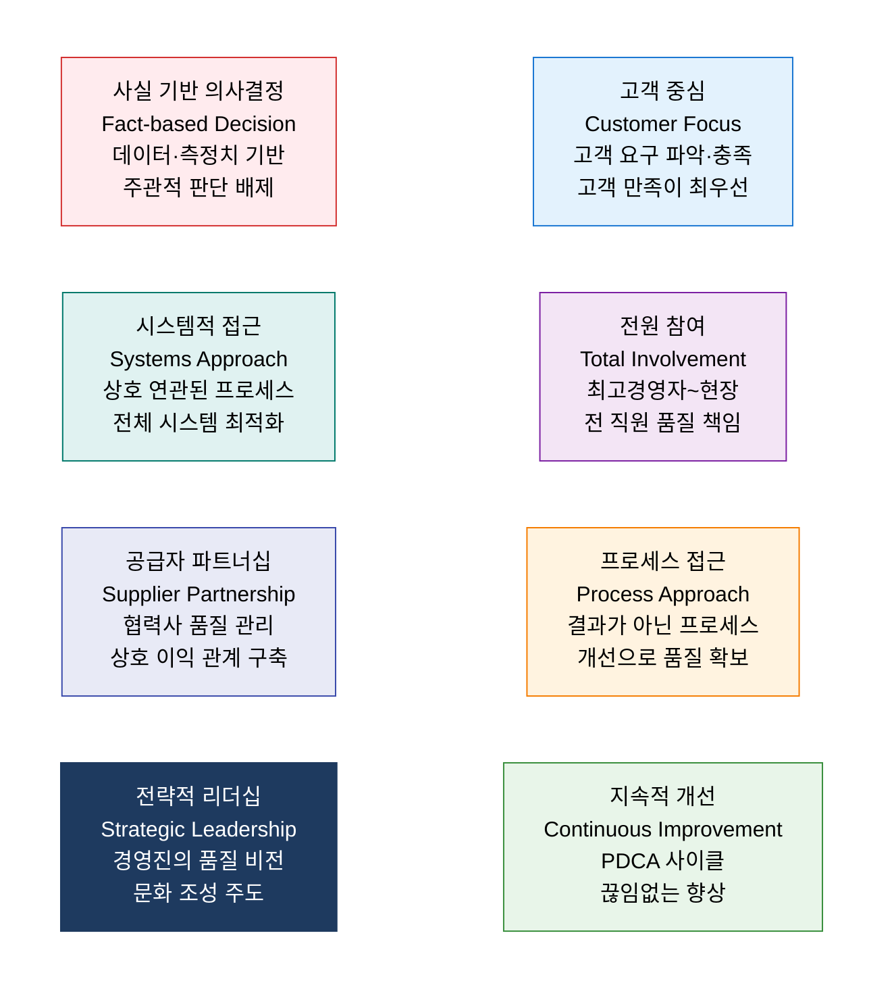
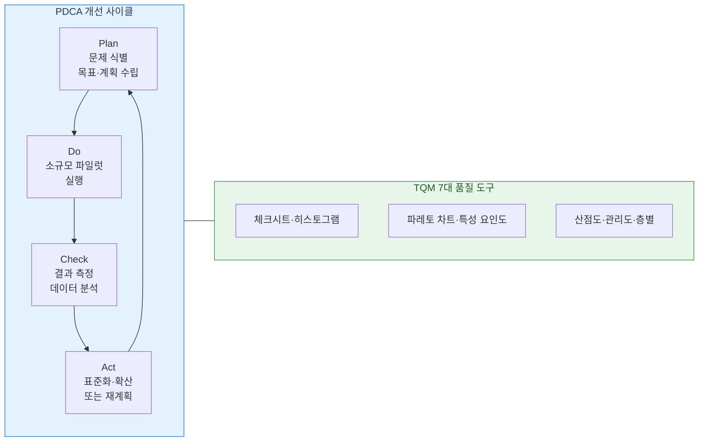

# TQM
**Total Quality Management — 전사적 품질 관리**

## 1. 전원 참여로 프로세스·제품 품질을 지속 개선하는 경영 철학, TQM의 개요

**정의**: W. Edwards Deming·Joseph Juran·Kaoru Ishikawa 등의 품질 사상을 기반으로 발전한 경영 철학으로, **고객 만족**을 궁극적 목표로 하여 조직의 전 구성원이 모든 프로세스·제품·서비스의 품질 개선에 참여하고, 데이터 기반의 지속적 개선(Continuous Improvement)을 추구하는 전사적 경영 방식.

**특징**:
- **전원 참여(Total Involvement)**: 최고 경영자부터 현장 작업자까지 품질에 대한 책임과 참여.
- **프로세스 지향**: 결과가 아닌 **프로세스 자체를 개선**하여 결함을 사전에 방지.
- ISO 9001·Six Sigma·Lean과 상호 보완적으로 활용되는 **품질 경영의 이론적 토대**.

---

## 2. TQM의 핵심 구성 체계

### 가. TQM 8대 핵심 원칙

**TQM 구루(Guru)별 핵심 기여**

| 품질 사상가 | 핵심 기여 | 대표 개념 |
|---|---|---|
| **W. Edwards Deming** | 통계적 프로세스 관리·14가지 경영 원칙 | PDCA 사이클, 변동의 원인 분류 |
| **Joseph Juran** | 품질 3부작(계획·통제·개선) | Juran Trilogy, 파레토 원칙 적용 |
| **Philip Crosby** | 무결점(Zero Defects)·품질 비용 개념 | "품질은 무료다(Quality is Free)" |
| **Kaoru Ishikawa** | 분임조(QC Circle)·특성 요인도 | 이시카와 다이어그램, 7가지 품질 도구 |

---

### 나. TQM 구현 모델 및 주요 도구

**TQM 주요 도구 및 적용 목적**

| 도구 | 목적 | SW·IT 적용 사례 |
|---|---|---|
| **체크시트** | 결함 유형·빈도 체계적 기록 | 버그 유형별 발생 빈도 일일 수집 |
| **히스토그램** | 데이터 분포·변동성 시각화 | 응답시간 분포 분석·SLA 준수율 확인 |
| **파레토 차트** | 주요 원인 우선순위화(80/20) | 상위 20% 결함 유형 집중 개선 |
| **특성 요인도 (Fishbone)** | 문제 원인 계층적 분석 | 장애 근본 원인 6M 기반 탐색 |
| **산점도** | 두 변수 간 상관관계 파악 | 코드 복잡도와 결함 밀도 상관 분석 |
| **관리도 (Control Chart)** | 프로세스 통계적 안정성 감시 | 배포 빈도·결함률 관리 한계 설정 |
| **층별 (Stratification)** | 데이터를 그룹별로 분류 분석 | 팀·스프린트·모듈별 결함률 비교 |

**TQM vs Six Sigma vs Lean 비교**

| 비교 항목 | TQM | Six Sigma | Lean |
|---|---|---|---|
| **철학** | 전사적 품질 문화 내재화 | 데이터 기반 결함률 최소화 | 낭비 제거·흐름 최적화 |
| **접근법** | 문화·사람·프로세스 통합 | DMAIC 방법론·통계 | 가치 흐름 분석·카이젠 |
| **범위** | 조직 전체 경영 혁신 | 프로젝트 단위 개선 | 프로세스 흐름 개선 |
| **핵심 도구** | 7가지 품질 도구·PDCA | DMAIC·통계 분석 | VSM·5S·칸반 |
| **통합 적용** | TQM 철학 위에 Six Sigma 방법론 + Lean 도구를 결합한 Lean Six Sigma 구현 가능 ||

---

## 3. TQM 도입의 기대효과 및 활용 방안

| 구분 | 주요 기대효과 | 활용 및 실무 적용 방안 |
|---|---|---|
| **품질 비용 절감** | 사전 예방 중심으로 결함·재작업 비용 대폭 감소 | QC 분임조 운영으로 현장 주도 품질 개선 과제 도출 |
| **고객 만족 향상** | 고객 요구 충족률·NPS 개선으로 충성 고객 확보 | VOC(고객의 소리) 체계화하여 제품·서비스 개선 피드백 반영 |
| **조직 문화 혁신** | 품질에 대한 전원 책임 의식·지속 개선 문화 정착 | 스프린트 회고를 PDCA 구조로 운영하여 애자일과 TQM 통합 |
| **ISO 9001 연계** | TQM 원칙이 ISO 9001 품질 경영 시스템의 철학적 기반 | ISO 9001 인증 취득 시 TQM 8대 원칙을 심사 기준으로 활용 |
