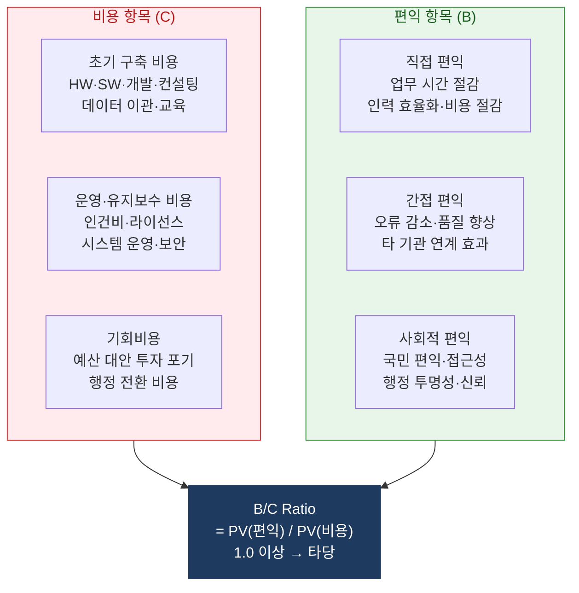
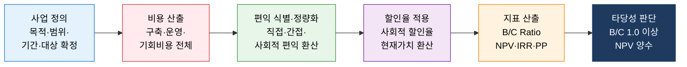

# 비용편익분석 (CBA)
**Cost-Benefit Analysis — 공공 IT 사업 타당성 평가**

## 1. 공공 IT 투자의 사회적 비용과 편익을 현재가치로 환산하여 사업 타당성을 객관적으로 판단하는 분석 체계, 비용편익분석의 개요

**개념**: 공공 정책·사업에 투입되는 **총 비용(Total Costs)** 과 사회 전체가 얻는 **총 편익(Total Benefits)** 을 금전적으로 정량화하고 현재가치(PV)로 환산하여 B/C Ratio·NPV를 산출함으로써 공공 IT 사업의 경제적 타당성을 판단하는 공공 투자 의사결정 분석 방법.

**특징**:
- **사회적 관점**: 민간 ROI와 달리 **사회 전체의 편익**(행정 효율화·국민 편익·외부 효과)을 포함.
- 한국의 경우 500억 원 이상 공공 정보화 사업은 **예비타당성 조사**(기재부·KDI) 대상으로 B/C Ratio 1.0 이상 요건.
- 정량화 어려운 **무형 편익**(민주주의·형평성·서비스 질 향상)은 별도 정성 평가로 보완.

---

## 2. 비용편익분석의 핵심 구성 체계

### 가. 비용·편익 항목 분류 및 산출 구조

**편익 정량화 방법론**

| 편익 유형 | 정량화 방법 | 공공 IT 적용 예시 |
|---|---|---|
| **업무 시간 절감** | 절감 시간 × 공무원 시간당 인건비 × 연간 처리 건수 | 민원 처리 시간 30분 절감 × 50만 건/년 |
| **종이·인쇄 절감** | 기존 종이 처리 비용 × 전자화 전환율 | 전자문서 전환으로 연 종이 비용 70% 절감 |
| **방문 교통비 절감** | 방문 1회 절감 교통비 × 비대면 전환 건수 | 온라인 민원으로 방문 불필요 교통비 절감 |
| **오류 재처리 절감** | 오류 처리 비용 × 감소율 | 자동화로 입력 오류 80% 감소 |
| **사회적 시간 가치** | 국민 대기 시간 × 사회적 시간 가치 | 민원 대기 시간 절감의 국민 경제적 가치 |

---

### 나. 공공 IT 타당성 평가 절차 및 기준

**한국 공공 IT 사업 타당성 평가 기준**

| 기준 | 내용 | 비고 |
|---|---|---|
| **B/C Ratio 기준** | 1.0 이상이면 경제적 타당성 확보 | 예비타당성 조사 핵심 지표 |
| **사회적 할인율** | 4.5% (한국 기획재정부 기준) | 공공 사업 현재가치 환산 기준 |
| **분석 기간** | 정보 시스템: 통상 5~10년 | 사업 유형·내용 연수 고려 |
| **예비타당성 대상** | 총 사업비 500억 원 이상 정보화 사업 | 기획재정부·KDI 수행 |
| **타당성 재조사** | 사업비 증가 20% 이상 또는 기간 3년 초과 시 | 기획재정부 요청 |

**공공 IT 비용편익분석 예시 — 전자민원 시스템 구축**

| 항목 | 3년 누계 (현재가치) |
|---|---|
| **총 비용 (C)** | 120억 원 |
| — 구축비 (HW·SW·개발) | 80억 원 |
| — 운영비 (3년) | 40억 원 |
| **총 편익 (B)** | 198억 원 |
| — 민원 처리 시간 절감 | 90억 원 |
| — 종이·인쇄 비용 절감 | 18억 원 |
| — 국민 교통비 절감 (사회적 편익) | 60억 원 |
| — 오류·재처리 비용 절감 | 30억 원 |
| **B/C Ratio** | **198 / 120 = 1.65** (타당) |
| **NPV** | **78억 원** (양수 → 타당) |
| **투자 회수 기간** | **약 22개월** |

---

## 3. 비용편익분석의 기대효과 및 활용 방안

| 구분 | 주요 기대효과 | 활용 및 실무 적용 방안 |
|---|---|---|
| **예산 확보** | 객관적 수치로 예산 당국·감사 기관 설득 | 사업 기획 단계에서 B/C Ratio·NPV 사전 산출 후 예산 요구서 첨부 |
| **사업 우선순위** | 복수 정보화 사업의 경제성 비교 순위 결정 | 연도별 정보화 사업 포트폴리오 B/C 기준 우선순위 선정 |
| **규제 대응** | 예비타당성 조사 의무 대상 사업 통과 근거 | KDI 예타 기준에 맞는 편익 항목·산출 방법론 사전 준비 |
| **성과 관리** | 투자 후 실제 편익 추적으로 계획 대비 효과성 검증 | 사업 완료 후 1~2년 실제 편익 측정 및 계획 대비 성과 보고 |
