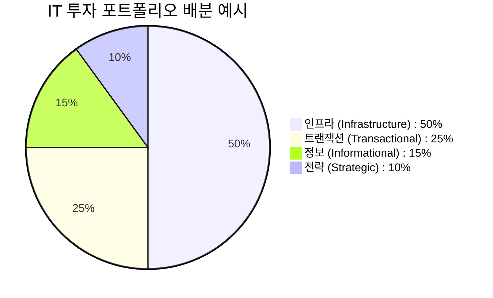
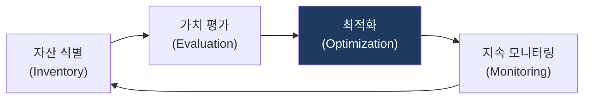

# IT Portfolio Management
**전략적 IT 포트폴리오 관리**

## 1. IT 자산의 최적 배분, IT 포트폴리오 관리의 개요

**정의**: IT 투자를 개별 프로젝트 단위가 아닌 통합된 자산 집합(Portfolio) 관점에서 분석하여, 위험을 최소화하고 비즈니스 가치를 극대화하도록 자원을 배분하는 기법.

**특징**:  
 **(포트폴리오 이론)** 금융 포트폴리오 이론을 IT에 적용하여 개별 프로젝트가 아닌 전체 관점에서 투자를 최적화.  
 **(위험-수익 균형)** 리스크가 높은 혁신 투자와 안정적 운영 투자의 최적 균형을 포트폴리오로 조정.  
 **(전략 정렬)** 비즈니스 전략과 IT 투자의 일치성을 지속 검증하여 전략 기여도 중심의 의사결정을 지원.  

---

## 2. IT 포트폴리오 관리의 구성 및 분석 모델

### 가. IT 포트폴리오의 4개 카테고리 (Weill & Broadbent 모델)

| 카테고리 | 목적 | 주요 투자 대상 |
|---|---|---|
| **인프라** | 공유 서비스 제공, 비용 절감 | 네트워크, 서버, 데이터베이스 표준화 |
| **트랜잭션** | 운영 효율성 증대, 반복 업무 자동화 | ERP, CRM 고도화, 프로세스 자동화 |
| **정보** | 의사결정 지원, 데이터 분석 | BI, DW, 빅데이터 분석 플랫폼 |
| **전략** | 시장 경쟁 우위 확보, 혁신 | 신규 비즈니스 모델 개발, 디지털 전환(DX) |

---

### 나. 포트폴리오 분석 및 관리 프로세스

| 단계 | 활동 내용 | 관리 지표 |
|---|---|---|
| **식별** | 전사 IT 자산 및 프로젝트 목록화 | 자산 연령, 유지보수 비용 |
| **평가** | 비즈니스 가치, 위험도, 기술 성숙도 측정 | ROI, 전략적 일치도 |
| **최적화** | 자원 배분 결정 (Buy, Hold, Sell) | 포트폴리오 믹스(Mix) |
| **모니터링** | 성과 추적 및 포트폴리오 재조정 | 실적 대비 편익 달성도 |

---

## 3. IT 포트폴리오 도입의 기대효과 및 활용 방안

| 구분 | 주요 기대효과 | 활용 및 실무 적용 방안 |
|---|---|---|
| **전략적 가치** | IT-비즈니스 정렬 가시화 | 투자 비중 조절을 통한 전략적 목표 달성 지원 |
| **자원 효율성** | 중복 투자 제거 | 자산 간 중복 기능 통폐합을 통한 IT 예산 절감 |
| **위험 관리** | 투자 위험 분산 | 고위험-고수익과 저위험-안정 자산 간의 균형 유지 |
