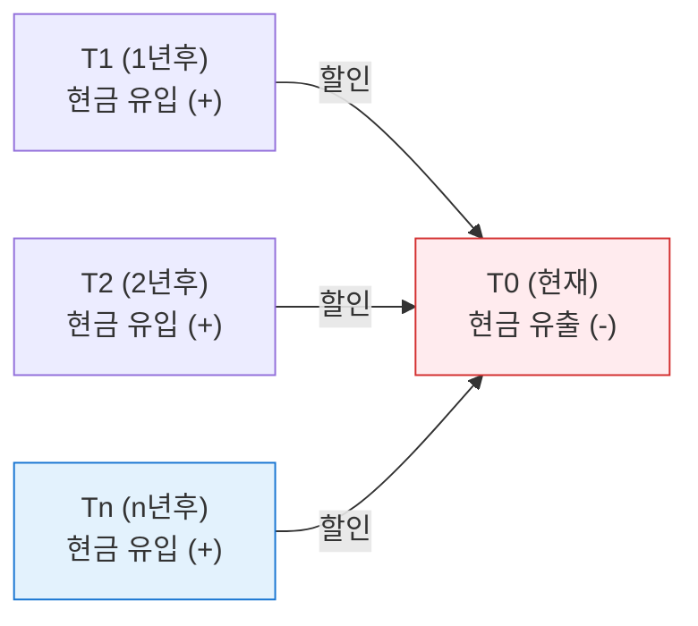

# NPV / IRR
**Net Present Value & Internal Rate of Return**

## 1. 화폐의 시간 가치를 고려한 투자 분석, NPV와 IRR의 개요

**개념**:
- **NPV (순현재가치)**: 투자로 인해 발생하는 현금 유입의 현재 가치에서 현금 유출의 현재 가치를 뺀 값.
- **IRR (내부수익률)**: 투자 프로젝트의 NPV를 0으로 만드는 할인율.

**특징**: 단순 회수기간법과 달리 **화폐의 시간 가치(Time Value of Money)** 를 고려하여 장기 프로젝트의 타당성을 객관적으로 평가.

---

## 2. NPV와 IRR의 산출 원리 및 의사결정 기준

### 가. 현금흐름 할인법 (DCF: Discounted Cash Flow) 구조

| 지표 | 공식 핵심 | 투자 결정 기준 |
|---|---|---|
| **NPV** | `NPV = Σ[Rt / (1+i)^t] - I0` | **NPV > 0** 이면 투자 채택 |
| **IRR** | `NPV = 0` 이 되는 할인율 `i` 산출 | **IRR > 자본비용** 이면 투자 채택 |

---

### 나. NPV와 IRR의 특성 비교

| 구분 | NPV (순현재가치법) | IRR (내부수익률법) |
|---|---|---|
| **핵심 가정** | 적절한 할인율(자본비용) 전제 | NPV를 0으로 만드는 수익률 자체 산출 |
| **가치 가산성** | 개별 NPV의 합이 전체 NPV (성립) | 수익률의 합은 전체 수익률 아님 (불성립) |
| **재투자 가정** | 자본비용으로 재투자 | IRR 자체 수익률로 재투자 |
| **장점** | 부(Wealth)의 극대화 지표로 가장 정확함 | 수익률(%)로 표현되어 이해하기 쉬움 |

---

## 3. IT 투자 의사결정 시 NPV/IRR 활용 전략

| 구분 | 주요 활용 방안 | 실무 적용 시 고려사항 |
|---|---|---|
| **상호 배타적 투자** | 복수의 프로젝트 중 최적 선택 | NPV가 가장 큰 프로젝트를 우선 선택하는 것이 원칙 |
| **자본 예산 할당** | 한정된 자원의 효율적 배분 | 수익성 지수(PI)와 함께 활용하여 투자 효율성 극대화 |
| **리스크 분석** | 민감도 분석(Sensitivity Analysis) | 할인율 변화에 따른 NPV 변동폭을 확인하여 위험 대응 |
