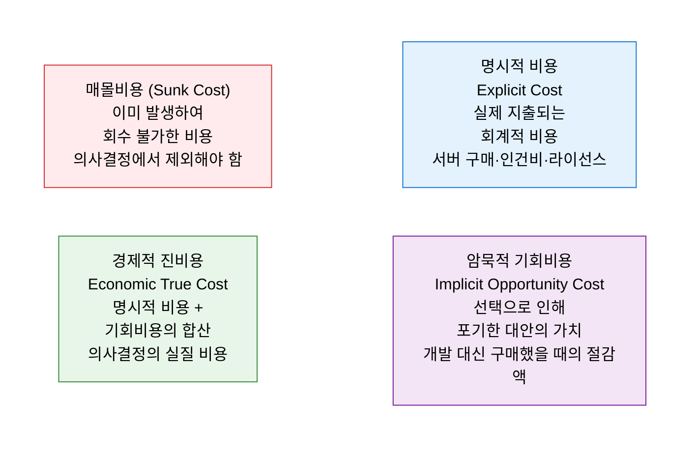
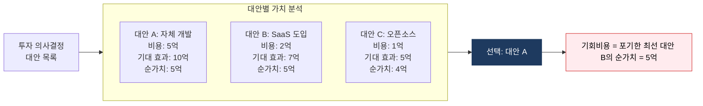

# 기회비용 (Opportunity Cost)
**선택하지 않은 최선의 대안이 가져다줄 수 있었던 가치**

## 1. 선택의 포기 비용으로 진정한 의사결정 비용을 파악하는 경제 개념, 기회비용의 개요

**정의**: 어떤 선택을 했을 때 포기해야 하는 **차선(次善)의 대안이 제공했을 최대 가치** 로, 의사결정의 진정한 경제적 비용을 측정하는 개념. IT 투자에서는 특정 프로젝트나 기술을 선택함으로써 포기한 다른 투자 기회의 가치를 명확히 하여 자원 배분의 효율성을 판단하는 데 활용.

**특징**:  
 **(암묵적 비용(Implicit Cost))** 회계 장부에 나타나지 않지만 경제적 의사결정에서 반드시 고려해야 하는 숨겨진 비용.  
 **(암묵적 비용 계산)** 기회비용 = 선택한 대안의 가치 - **포기한 최선 대안의 가치** (항상 최선의 포기 대안 기준).  
 **(자원 배분 최적화)** 희소한 IT 예산·인력·시간 자원의 **배분 최적화** 판단에 핵심 개념.  

---

## 2. 기회비용의 핵심 구성 체계

### 가. 기회비용의 개념 및 유형

**기회비용 유형별 IT 적용 사례**

| 유형 | 설명 | IT 사례 |
|---|---|---|
| **자본 기회비용** | IT 투자 대신 다른 금융 자산에 투자했을 때의 수익 | 서버 구매 자금을 채권에 투자 시 연 4% 이자 = 기회비용 |
| **시간 기회비용** | 특정 작업에 투입한 시간으로 할 수 있었던 다른 작업의 가치 | 레거시 유지보수에 투입된 개발자 시간 = 신기능 개발 지연 |
| **인력 기회비용** | A 프로젝트에 투입한 인력이 B 프로젝트에서 창출했을 가치 | 사내 개발팀을 운영(Operate)에 투입 시 혁신 프로젝트 기회 손실 |
| **인프라 기회비용** | 온프레미스 서버 유지에 묶인 자원의 클라우드 전환 가치 | IDC 유지 비용으로 클라우드 전환 시 절감 가능한 운영 비용 |

---

### 나. IT 투자 의사결정 적용

**IT 의사결정 시나리오별 기회비용 분석**

| 의사결정 | 선택 | 포기한 최선 대안 | 기회비용 |
|---|---|---|---|
| **Build vs Buy** | 자체 개발 (6개월·5명) | SaaS 즉시 도입 (월 200만 원) | 6개월 지연에 따른 비즈니스 가치 손실 + 인건비 차액 |
| **온프레미스 vs 클라우드** | IDC 서버 구매 (5억) | AWS 사용량 기반 과금 | 5억 투자금의 자본 기회비용 + 유연성 손실 |
| **레거시 유지 vs 마이그레이션** | 레거시 유지보수 | 신규 플랫폼 전환 | 기술 부채 누적 + 개발자 혁신 기회 손실 |
| **기술 스택 선택** | 특정 벤더 플랫폼 | 오픈 소스 생태계 | 벤더 종속(Lock-in) 위험 + 전환 비용 |

**매몰비용의 함정 vs 기회비용 사고**

| 구분 | 매몰비용 오류 | 기회비용 사고 |
|---|---|---|
| **상황** | 이미 3억 투자한 프로젝트가 실패 기로 | 동일 상황 |
| **잘못된 판단** | "3억 투자했으니 계속해야 한다" | — |
| **올바른 판단** | 과거 비용은 무시 | "지금 중단하고 다른 대안을 선택했을 때의 가치는 얼마인가?" |
| **결론** | 매몰비용은 의사결정에서 제외 | 미래 기회비용 기준으로 판단 |

---

## 3. 기회비용 분석의 기대효과 및 활용 방안

| 구분 | 주요 기대효과 | 활용 및 실무 적용 방안 |
|---|---|---|
| **자원 최적 배분** | 제한된 IT 예산·인력의 최고 가치 용도 선택 | 연간 IT 투자 계획 수립 시 대안별 기회비용 명시 비교 |
| **Build vs Buy 판단** | 자체 개발 대 SaaS·패키지 도입의 실질 비용 비교 | TCO + 기회비용(시장 출시 지연 가치)을 함께 산정 |
| **기술 부채 관리** | 레거시 유지에 따른 기회비용을 가시화하여 전환 결정 | 레거시 유지 시 연간 기회비용 산출 → 마이그레이션 ROI 비교 |
| **경영진 보고** | 단순 비용이 아닌 포기한 가치를 포함한 의사결정 근거 제시 | "A안 선택 시 B안 대비 기회비용 OO억 원 발생" 형식으로 보고 |
