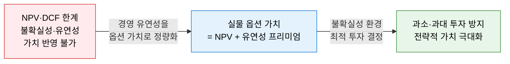
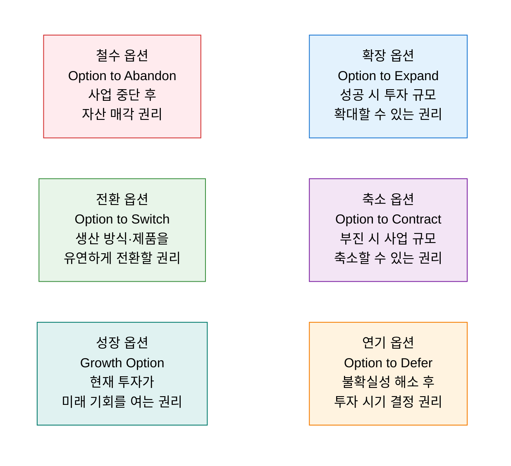
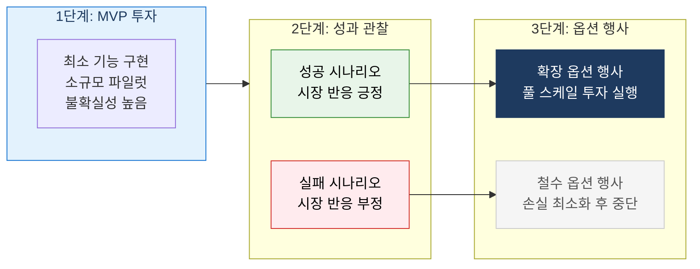

# Real Options Analysis
**실물 옵션 분석 — 불확실성 환경에서 경영 유연성의 가치를 반영한 투자 평가**

## 1. 경영 유연성을 금융 옵션으로 정량화하는 불확실성 대응 투자 평가법, 실물 옵션 분석의 개요

**정의**: 금융 옵션(Financial Option) 이론을 실물 자산(Real Asset) 투자 결정에 적용한 프레임워크로, 불확실성이 높은 환경에서 경영자가 보유하는 **확장·축소·연기·철수 등의 의사결정 유연성(Managerial Flexibility)** 을 옵션 가치로 정량화하여 기존 NPV/DCF가 과소평가하는 투자 기회의 전략적 가치를 보완하는 분석 방법.

**특징**:
- **실물 옵션 가치 = 기본 NPV + 유연성 옵션 가치** — 불확실성이 클수록 옵션 가치 증가.
- 전통적 NPV가 음(-)이더라도 옵션 가치 포함 시 투자 타당성이 확보될 수 있음.
- 클라우드 전환·AI 도입·디지털 전환 등 **불확실성 높은 IT 투자** 의사결정에 특히 유효.

---

## 2. 실물 옵션 분석의 핵심 구성 체계

### 가. 실물 옵션의 유형 및 가치 평가

**실물 옵션 가치 결정 요인 (Black-Scholes 유추)**

| 금융 옵션 변수 | 실물 옵션 대응 개념 | 옵션 가치와의 관계 |
|---|---|---|
| **기초 자산 가격 (S)** | 투자 자산의 현재 가치 (PV of Cash Flows) | 높을수록 옵션 가치 증가 |
| **행사 가격 (K)** | 투자 실행에 필요한 비용 | 낮을수록 옵션 가치 증가 |
| **만기 (T)** | 의사결정을 유예할 수 있는 기간 | 길수록 옵션 가치 증가 |
| **변동성 (σ)** | 미래 현금흐름의 불확실성·변동성 | 높을수록 옵션 가치 증가 |
| **무위험 이자율 (r)** | 시장 이자율 | 높을수록 콜옵션 가치 증가 |

---

### 나. IT 투자 의사결정 적용

**IT 투자별 실물 옵션 적용 사례**

| IT 투자 시나리오 | 옵션 유형 | 실물 옵션 사고 적용 |
|---|---|---|
| **클라우드 전환** | 확장·축소 옵션 | 소규모 워크로드 먼저 이전 후 성과에 따라 전환 범위 확대·축소 |
| **AI·ML 도입** | 연기·성장 옵션 | 기술 성숙도 관찰 후 최적 시점 투자, 데이터 파이프라인 구축이 미래 AI 옵션 |
| **디지털 전환** | 성장·전환 옵션 | MVP로 디지털 서비스 검증 후 확장, 온프레미스↔클라우드 전환 유연성 확보 |
| **오픈소스 도입** | 전환·철수 옵션 | 상용 SW 대신 오픈소스 도입으로 벤더 종속 탈피·전환 유연성 확보 |
| **플랫폼 투자** | 성장 옵션 | 플랫폼 인프라 구축이 다양한 미래 서비스 론칭 기회를 열어줌 |

**전통 NPV vs 실물 옵션 비교**

| 비교 항목 | 전통 NPV/DCF | 실물 옵션 분석 |
|---|---|---|
| **불확실성 처리** | 높은 할인율로 불확실성 패널티 부과 | 불확실성을 옵션 가치 원천으로 인식 |
| **경영 유연성** | 고려 안 함 (수동적 투자 가정) | 핵심 가치 요소로 명시적 반영 |
| **투자 결정** | NPV > 0 이면 투자, 음(-)이면 기각 | NPV + 옵션 가치 > 0 이면 투자 |
| **불확실성 많을수록** | 투자 가치 감소 | 옵션 가치 증가 — 투자 가치 상승 |
| **적합 상황** | 안정적·예측 가능한 현금흐름 | 불확실성 높고 유연성이 있는 투자 |

---

## 3. 실물 옵션 분석의 기대효과 및 활용 방안

| 구분 | 주요 기대효과 | 활용 및 실무 적용 방안 |
|---|---|---|
| **과소 투자 방지** | NPV 음수라도 전략적 유연성 가치 포함 시 투자 타당성 확보 | 클라우드·AI 도입 제안 시 성장 옵션 가치를 사업 계획서에 명시 |
| **단계적 투자 설계** | MVP → 검증 → 확장의 단계적 투자로 리스크 최소화 | 디지털 전환 로드맵을 실물 옵션 트리(Decision Tree) 구조로 설계 |
| **불확실성 활용** | 불확실성을 위험이 아닌 유연성 원천으로 재해석 | 기술 변화 빠른 AI·클라우드 투자의 의사결정 프레임으로 활용 |
| **경영진 소통** | 전략적 투자의 유연성 가치를 수치로 설득 | "옵션 가치 OO억 원 포함 시 총 투자 가치 양수" 형식으로 보고 |
