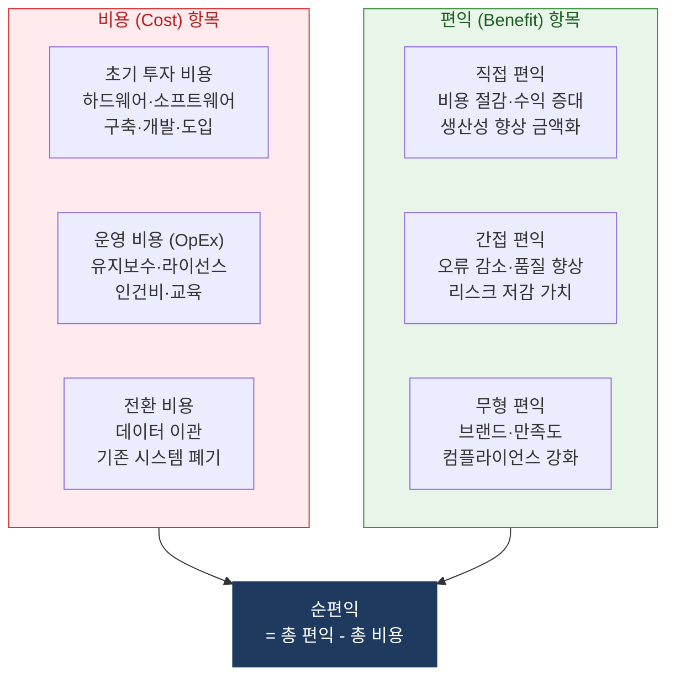
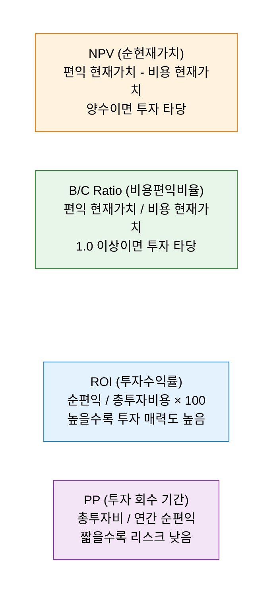

# 경제성 정당화 분석 (REI)
**Return on IT Investment & Economic Justification Analysis**

## 1. IT 투자 비용·편익 체계 산출로 경제성 타당성을 입증하는 분석, 경제성 정당화 분석의 개요

**정의**: IT 시스템·서비스·프로젝트에 대한 투자 결정 시 **총 비용(Total Cost)** 과 **기대 편익(Expected Benefits)** 을 체계적으로 식별·정량화하여 투자의 경제적 타당성을 ROI·NPV·PP·IRR 등의 재무 지표로 입증하는 의사결정 지원 분석 체계.

**특징**:
- **정량적 편익 산출** 이 핵심 — 업무 효율화·비용 절감·수익 증대를 금액으로 환산.
- 공공 정보화 사업의 경우 **예비타당성 조사** 와 연계하여 비용편익비율(B/C Ratio) 산출 의무화.
- 정량화 어려운 **무형 편익(Intangible Benefits)** — 브랜드 이미지·직원 만족도·보안 강화 — 별도 정성 평가.

---

## 2. 경제성 정당화 분석의 핵심 구성 체계

### 가. 비용-편익 분석 구조

**편익 정량화 방법론**

| 편익 유형 | 정량화 방법 | 산출 예시 |
|---|---|---|
| **인력 생산성 향상** | (절감 시간 × 시간당 인건비) × 연간 처리 건수 | 월 2시간 절감 × 50명 × 시간당 5만 원 = 연 6천만 원 |
| **오류·재작업 감소** | 오류 처리 비용 × 감소율 | 건당 처리비 10만 원 × 월 200건 × 30% 감소 = 연 7.2천만 원 |
| **다운타임 방지** | MTTR 단축 × 시간당 매출 손실 | 월 2회 × 2시간 × 시간당 손실 1천만 원 = 연 4.8억 원 |
| **종이·물자 절감** | 기존 비용 × 절감율 | 연 인쇄비 5천만 원 × 70% 감소 = 연 3.5천만 원 |

---

### 나. 경제성 정당화 주요 지표 및 산출 방법

**경제성 정당화 지표 산출 예시 — 클라우드 전환 사업**

| 항목 | 금액 |
|---|---|
| **총 투자 비용 (3년)** | 15억 원 |
| — 클라우드 구축·이관 | 5억 원 |
| — 연간 클라우드 운영비 (3년) | 10억 원 |
| **총 기대 편익 (3년)** | 24억 원 |
| — IDC·서버 유지비 절감 | 9억 원 |
| — 인프라 운영 인력 효율화 | 6억 원 |
| — 서비스 가용성 향상 편익 | 6억 원 |
| — 확장성·민첩성 가치 | 3억 원 |
| **ROI** | `(24-15) / 15 × 100 = 60%` |
| **투자 회수 기간 (PP)** | `15억 / (24억/3년) = 1.875년 ≈ 22개월` |
| **NPV (할인율 10%)** | `약 5.2억 원 (양수 → 투자 타당)` |
| **B/C Ratio** | `24억 / 15억 = 1.6 (1.0 초과 → 타당)` |

**공공 정보화 사업 경제성 분석 기준**

| 기준 | 내용 | 비고 |
|---|---|---|
| **B/C Ratio** | 1.0 이상이면 경제적 타당성 확보 | 예비타당성 조사 핵심 지표 |
| **NPV** | 양수(+)이면 투자 타당 | 사회적 할인율 적용 |
| **분석 기간** | 사업 유형별 5~20년 분석 | 정보 시스템: 통상 5~10년 |
| **할인율** | 사회적 할인율 4.5% (한국 기준) | 민간: WACC 기반 |

---

## 3. 경제성 정당화 분석의 기대효과 및 활용 방안

| 구분 | 주요 기대효과 | 활용 및 실무 적용 방안 |
|---|---|---|
| **예산 확보** | 데이터 기반 투자 타당성으로 경영진·예산 부서 설득 | IT 사업 제안서에 ROI·PP·NPV 수치와 산출 근거 명시 |
| **우선순위 결정** | 복수 IT 사업의 경제성 비교로 투자 순위 결정 | 연간 IT 예산 배분 시 사업별 ROI 순으로 우선순위 결정 |
| **공공 발주** | 정보화 사업 예비타당성·심사 통과 근거 자료 | B/C Ratio·사회적 편익 산출로 공공 사업 타당성 입증 |
| **성과 관리** | 투자 후 실제 편익 추적으로 사업 효과성 검증 | 사업 완료 후 1~2년 실제 ROI 측정하여 계획 대비 성과 보고 |
