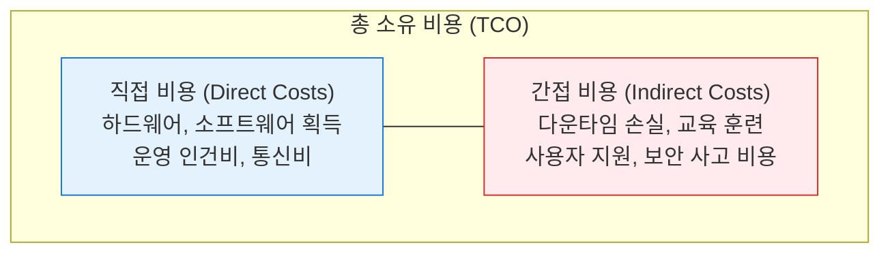
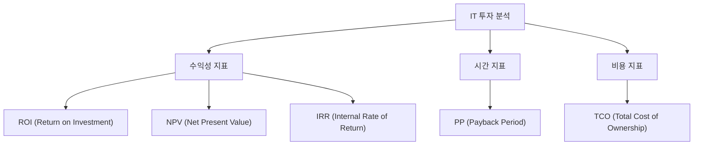

# ROI / TCO
**Return on Investment & Total Cost of Ownership**

## 1. IT 투자 효율성 분석의 핵심, ROI와 TCO의 개요

**정의**:
- **ROI**: 투자한 비용 대비 얻은 이익의 비율을 나타내는 수익성 지표.
- **TCO**: 자산의 획득부터 폐기까지 발생하는 모든 직접/간접 비용의 총합.

**특징**: IT 투자의 타당성을 검증하기 위해 비용(TCO)과 편익(ROI)을 동시에 분석하여 의사결정을 지원함.

---

## 2. ROI와 TCO의 산출 방식 및 분석 프레임워크

### 가. TCO의 구성 요소 (Direct & Indirect Costs)

| 구분 | 주요 항목 | 비고 |
|---|---|---|
| **직접 비용** | 서버/PC 구매, SW 라이선스, 네트워크 구축, 유지보수료 | 가시적 비용 (Visible) |
| **간접 비용** | 사용자 교육, 기술 지원, 계획되지 않은 가동 중단 손실 | 숨겨진 비용 (Hidden) |

---

### 나. ROI 산출 및 투자 타당성 분석 지표

| 지표 | 산식 / 의미 | 결정 기준 |
|---|---|---|
| **ROI** | (총 편익 - 총 비용) / 총 비용 × 100 | 높을수록 유리 |
| **PP** (회수기간) | 투자 원금을 회수하는 데 걸리는 기간 | 짧을수록 유리 |
| **NPV** (순현재가치) | 현금 유입 현재가치 - 현금 유출 현재가치 | 0보다 크면 투자 |
| **IRR** (내부수익률) | NPV를 0으로 만드는 할인율 | 자본비용보다 크면 투자 |

---

## 3. ROI / TCO 분석의 활용 방안 및 한계점

| 구분 | 주요 활용 방안 | 실무 적용 시 고려사항 |
|---|---|---|
| **의사결정** | 신규 IT 프로젝트 승인 | 정량적 데이터 기반의 투자 우선순위 결정 및 예산 확보 |
| **비용 관리** | 숨겨진 운영 비용 식별 | 클라우드 전환 시 온프레미스 대비 TCO 비교 분석 |
| **한계점 극복** | 정성적 가치 반영 | 전략적 정렬, 브랜드 가치 등 무형적 편익을 포함한 분석 필요 |
