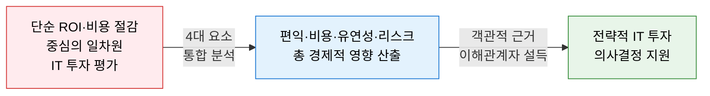
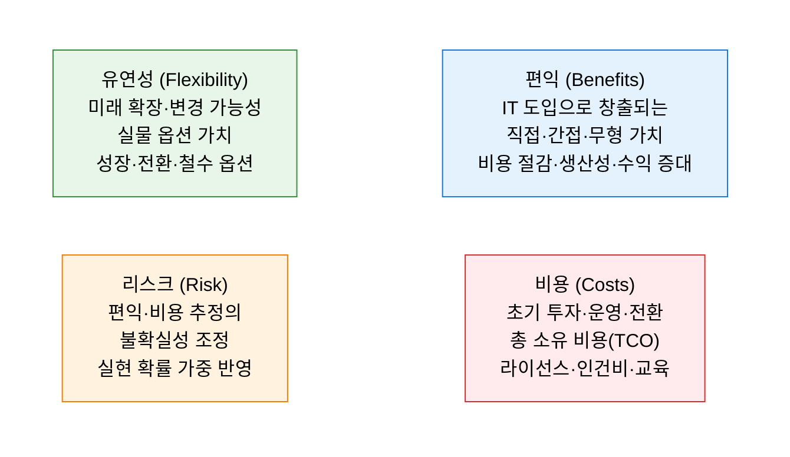
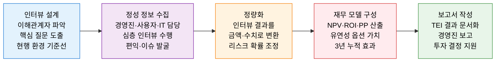

# TEI
**Total Economic Impact — 총 경제적 영향 평가**

## 1. 편익·유연성·리스크를 통합한 IT 투자 가치 측정 방법론, TEI의 개요

**정의**: Forrester Research가 개발한 IT 투자 가치 측정 프레임워크로, 기존 ROI 분석이 놓치기 쉬운 **유연성(Flexibility)** 과 **리스크(Risk)** 요소를 포함하여 **편익(Benefits), 비용(Costs), 유연성(Flexibility), 리스크(Risk)** 의 4가지 요소로 IT 투자의 총체적 경제적 영향을 측정하고 투자 타당성을 종합적으로 평가하는 방법론.

**특징**:  
 **(인터뷰 기반 실증 분석)** 고객·사용자·관리자 심층 인터뷰로 정성적 편익을 정량화.  
 **(리스크 조정 가치)** 불확실성을 확률 가중치로 반영하여 편익·비용을 현실적으로 보정.  
 **(제3자 독립 평가)** Forrester가 특정 벤더의 의뢰를 받아 수행하는 **제3자 독립 평가 보고서** 형태로 활용.  

---

## 2. TEI의 핵심 구성 체계

### 가. TEI 4대 구성 요소

**4대 요소 상세 분석 내용**

| 요소 | 핵심 분석 내용 | 산출 방법 |
|---|---|---|
| **편익** | 비용 절감·인력 효율화·수익 증대·오류 감소 등 가치화 | 인터뷰 기반 정량화 + 현재가치 할인 |
| **비용** | 소프트웨어·하드웨어·구현·훈련·유지보수 전체 TCO | 3~5년 총 소유 비용 산출 |
| **유연성** | 향후 추가 투자·확장 기회의 실물 옵션 가치 | Black-Scholes 또는 간이 옵션 모델 |
| **리스크** | 편익·비용 추정값의 불확실성을 확률로 조정 | 삼각 분포·몬테카를로 시뮬레이션 |

---

### 나. 총 경제적 영향 산출 및 활용

**TEI 산출 예시 — 클라우드 보안 솔루션 도입 (3년 기준)**

| 구분 | 항목 | 리스크 조정 전 | 리스크 조정 후 |
|---|---|---|---|
| **편익** | 보안 사고 대응 비용 절감 | 8억 원 | 6.4억 원 (80% 실현 확률) |
| | IT 운영 효율화 | 5억 원 | 4억 원 (80% 실현 확률) |
| | 컴플라이언스 비용 절감 | 3억 원 | 2.4억 원 (80% 실현 확률) |
| **편익 합계** | | **16억 원** | **12.8억 원** |
| **비용** | 라이선스·구현·운영 (3년) | -8억 원 | -8.8억 원 (110% 비용 발생) |
| **유연성** | 추가 모듈 확장 옵션 가치 | — | +1.5억 원 |
| **순 현재 가치 (NPV)** | | — | **5.5억 원** |
| **ROI** | | — | **69%** |
| **투자 회수 기간** | | — | **약 17개월** |

**TEI vs 전통 ROI 비교**

| 비교 항목 | 전통 ROI 분석 | TEI 방법론 |
|---|---|---|
| **편익 범위** | 직접 비용 절감 중심 | 직접·간접·무형 편익 포함 |
| **유연성** | 고려 안 함 | 실물 옵션 가치로 정량화 |
| **리스크** | 할인율에 간접 반영 | 명시적 확률 조정으로 반영 |
| **데이터 소스** | 재무 데이터 중심 | 인터뷰 + 재무 데이터 통합 |
| **활용 목적** | 내부 투자 타당성 검토 | 외부 제3자 검증·벤더 평가 |

---

## 3. TEI 방법론의 기대효과 및 활용 방안

| 구분 | 주요 기대효과 | 활용 및 실무 적용 방안 |
|---|---|---|
| **투자 정당화** | 4요소 통합 분석으로 IT 투자의 실질 가치 입증 | 경영진·이사회 보고 시 TEI 보고서로 투자 승인 근거 제시 |
| **벤더 비교** | Forrester TEI 보고서를 솔루션 선정 비교 자료로 활용 | RFP 평가 시 벤더별 독립 TEI 보고서 요청·비교 |
| **리스크 가시화** | 불확실성을 확률로 조정하여 낙관적 편익 과대평가 방지 | 편익 실현 확률을 명시하여 보수적 투자 계획 수립 |
| **공공 조달** | 제3자 독립 평가 형식으로 공공 IT 사업 타당성 보완 | 예비타당성 조사 보완 자료로 TEI 방식 비용편익 분석 활용 |
