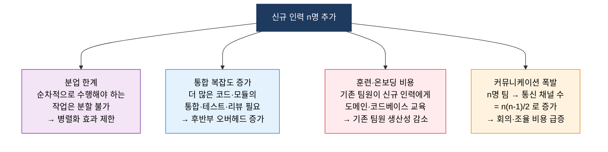
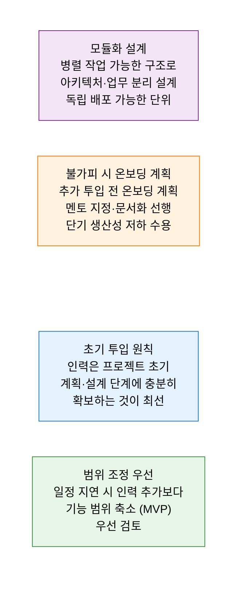

# Brooks' Law
**"지연된 소프트웨어 프로젝트에 인력을 추가하면 더 늦어진다"**

## 1. 지연 프로젝트에 인력 추가가 오히려 완료를 늦추는 역설적 법칙, Brooks' Law의 개요

**정의**: Fred Brooks가 저서 "The Mythical Man-Month"(1975)에서 제시한 법칙으로, **"지연된 소프트웨어 프로젝트에 인력을 추가하면 프로젝트는 더 늦어진다(Adding manpower to a late software project makes it later)"** 는 역설적 현상을 설명하는 SW 프로젝트 관리의 핵심 원칙.

**특징**:
- 소프트웨어 개발은 순수 병렬화가 어렵고, 인력 간 **커뮤니케이션 오버헤드** 가 인원 수의 제곱에 비례하여 증가.
- 신규 투입 인력의 **온보딩·교육** 에 기존 팀원의 시간과 에너지가 소모.
- 공수(Man-Month)는 교환 가능한 단위가 아님 — "9명이 1개월에 할 일을 1명이 9개월에 할 수 없는 것처럼, 그 역도 성립하지 않는다".

---

## 2. Brooks' Law의 핵심 구성 체계

### 가. 인력 추가가 프로젝트를 지연시키는 메커니즘

**커뮤니케이션 채널 폭발 (n명 팀의 통신 채널 수 = n(n-1)/2)**

| 팀 규모 | 통신 채널 수 | 증가 배율 |
|---|---|---|
| **3명** | 3개 | 기준 |
| **5명** | 10개 | 3.3배 |
| **10명** | 45개 | 15배 |
| **20명** | 190개 | 63배 |
| **50명** | 1,225개 | 408배 |

**Amdahl's Law와 병렬화 한계**

소프트웨어 작업 중 병렬화 가능한 비율이 P라면, 아무리 인력을 늘려도 속도 향상의 상한선은 존재.

| 병렬화 비율 | 10명 투입 시 최대 속도 향상 |
|---|---|
| 50% 병렬화 가능 | 최대 2배 (나머지 50%는 순차 수행) |
| 75% 병렬화 가능 | 최대 4배 |
| 95% 병렬화 가능 | 최대 20배 |
| **SW 개발 현실** | **대부분의 핵심 작업은 순차적** |

---

### 나. 실무 대응 전략

**일정 지연 시 대응 옵션 비교**

| 대응 옵션 | 단기 효과 | 장기 효과 | 권장 상황 |
|---|---|---|---|
| **인력 추가** | 일시 생산성 저하 | 온보딩 완료 후 회복 가능 | 초기·중반부, 병렬화 가능 작업 多 |
| **범위 축소 (MVP)** | 즉각 일정 단축 | 기능 차감에 따른 재협의 | 후반부 지연, 핵심 기능 우선 정의 가능 시 |
| **야근·초과 근무** | 단기 생산성 향상 | 번아웃·품질 저하 위험 | 단기 마감 돌파에 한정 사용 |
| **일정 재협상** | 이해관계자 설득 필요 | 품질·팀 지속성 보장 | 요구사항 변경·리스크 사전 인지 실패 시 |
| **기술 부채 수용** | 빠른 출시 | 장기 유지보수 비용 증가 | 시장 선점 가치가 품질보다 중요한 경우 |

---

## 3. Brooks' Law 이해의 기대효과 및 활용 방안

| 구분 | 주요 기대효과 | 활용 및 실무 적용 방안 |
|---|---|---|
| **프로젝트 계획** | 초기 적정 인력 배치로 중반 이후 투입 필요성 최소화 | 킥오프 단계에서 전체 인력 계획을 수립하고 버퍼 포함 |
| **범위 관리** | 지연 시 인력 추가보다 범위 조정을 우선 고려 | 스프린트 리뷰에서 MVP 기준으로 우선순위 재조정 |
| **아키텍처 설계** | 병렬 작업 가능하도록 모듈화·서비스 분리 | MSA·도메인 분리로 팀별 독립 개발 가능한 구조 설계 |
| **이해관계자 교육** | "인력 = 생산성" 단순 공식의 오류를 관리자·고객에게 설명 | Brooks' Law를 근거로 무리한 인력 투입 요구에 합리적 대응 |
