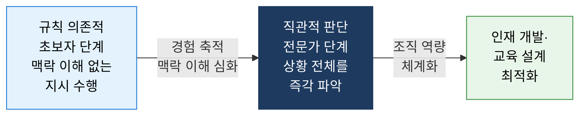
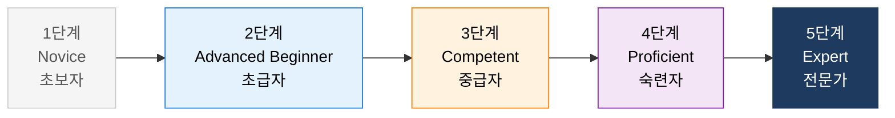
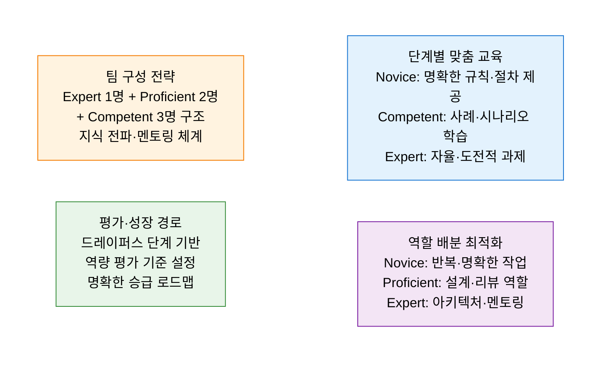

# Dreyfus Model
**드레이퍼스 기술 습득 단계 모델 — 초보자에서 전문가까지의 인지 변화**

## 1. 초보자에서 전문가로 성장하는 5단계 기술 습득 경로와 각 단계별 인지·행동 특성을 정의하는 모델, Dreyfus Model의 개요

**개념**: Stuart Dreyfus와 Hubert Dreyfus 형제가 개발한 기술 습득 이론으로, 개인이 어떤 분야의 기술을 습득할 때 **Novice(초보자) → Advanced Beginner(초급자) → Competent(중급자) → Proficient(숙련자) → Expert(전문가)** 의 5단계를 거치며 규칙 의존적 사고에서 직관적 전문 판단으로 인지 방식이 변화하는 과정을 설명하는 모델.

**특징**:
- 각 단계는 **규칙 활용 방식·상황 인식·의사결정 방식** 의 질적 변화로 구분.
- 전문가는 규칙을 명시적으로 따르지 않고 상황을 전체적으로 인식하여 **직관적 즉각 판단**.
- SW 공학·교육 설계·인재 개발·팀 구성에서 역할 배분과 맞춤형 지원 체계 설계에 활용.

---

## 2. Dreyfus Model의 핵심 구성 체계

### 가. 5단계 기술 습득 모델 구조

**단계별 특성 상세**

| 단계 | 규칙 활용 | 상황 인식 | 의사결정 방식 | IT 직무 적용 예시 |
|---|---|---|---|---|
| **1. Novice** | 명시적 규칙만 따름 | 맥락 없는 개별 요소만 인식 | 규칙 기반 기계적 수행 | 설치 매뉴얼대로만 작업하는 신입 |
| **2. Advanced Beginner** | 일부 예외 상황 인식 | 반복 경험으로 패턴 파악 시작 | 기준에 따라 행동하나 중요도 구분 어려움 | 자주 보는 에러 메시지를 경험으로 해결 |
| **3. Competent** | 장기 목표 수립 가능 | 계획·우선순위 설정 가능 | 의식적 분석·계획 후 행동 | 프로젝트 계획을 세워 체계적으로 관리 |
| **4. Proficient** | 규칙보다 상황 전체 인식 | 상황을 총체적으로 파악 | 경험 기반 직관 + 분석적 판단 | 코드 전체 흐름을 보며 최적 설계 제안 |
| **5. Expert** | 규칙 내면화·의식하지 않음 | 상황의 본질을 즉각 파악 | 완전한 직관적 즉각 판단 | 코드 한 줄을 보고 잠재 버그·설계 문제 즉각 파악 |

---

### 나. 조직 역량 관리 및 인재 개발 적용

**단계별 최적 교육·지원 전략**

| 단계 | 학습 필요 사항 | 효과적 교육 방법 | 관리자 역할 |
|---|---|---|---|
| **Novice** | 명확한 규칙·절차·체크리스트 | 단계별 매뉴얼, 1:1 지도 | 세부 지시·즉각 피드백 제공 |
| **Advanced Beginner** | 상황별 패턴 인식 경험 축적 | 사례 학습, 페어 프로그래밍 | 맥락 설명·예외 상황 노출 |
| **Competent** | 목표 설정·계획 수립 능력 | 프로젝트 주도 경험, 회고 | 자율성 부여·목표 설정 지원 |
| **Proficient** | 직관 개발·전체 관점 습득 | 멘토링, 복잡한 문제 도전 | 의사결정 위임·성찰 유도 |
| **Expert** | 암묵지 언어화·지식 전수 | 강의·저술·오픈소스 기여 | 조직 내 지식 확산 역할 부여 |

**드레이퍼스 모델 × IT 조직 적용 사례**

| IT 역할 | Novice 기준 | Expert 기준 |
|---|---|---|
| **소프트웨어 개발자** | 요구사항대로 코드 작성 가능 | 아키텍처 설계·코드 리뷰 즉각 판단 |
| **DevOps 엔지니어** | 표준 CI/CD 절차 수행 | 장애 상황에서 직관적 원인 파악·대응 |
| **보안 전문가** | OWASP 체크리스트 수행 | 코드·로그에서 패턴으로 침해 즉각 감지 |
| **데이터 분석가** | SQL 쿼리 템플릿 활용 | 데이터 패턴에서 비즈니스 인사이트 즉각 도출 |

---

## 3. Dreyfus Model 적용의 기대효과 및 활용 방안

| 구분 | 주요 기대효과 | 활용 및 실무 적용 방안 |
|---|---|---|
| **맞춤형 교육** | 획일적 교육에서 단계별 최적화 교육으로 학습 효율 향상 | 신입 온보딩을 Novice 맞춤 매뉴얼+멘토 지정 구조로 설계 |
| **팀 설계** | 단계 혼합 팀 구성으로 지식 전파·멘토링 자연스럽게 발생 | Expert 1명이 팀 전체 코드 리뷰를 통해 Novice 역량 성장 촉진 |
| **역량 평가** | 명확한 단계 기준으로 객관적 역량 평가·승진 기준 수립 | 드레이퍼스 5단계를 직무 등급(Junior~Principal) 기준으로 활용 |
| **지식 경영** | Expert의 암묵지를 명시지로 변환하여 조직 지식 자산화 | 사내 기술 블로그·강의·문서화로 Expert 지식 조직 공유 |
