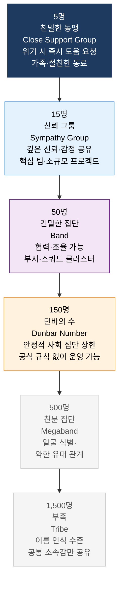
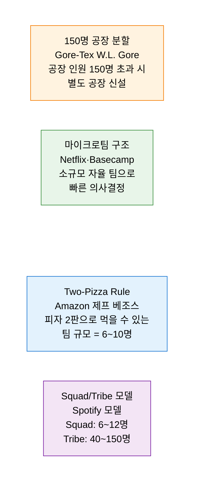
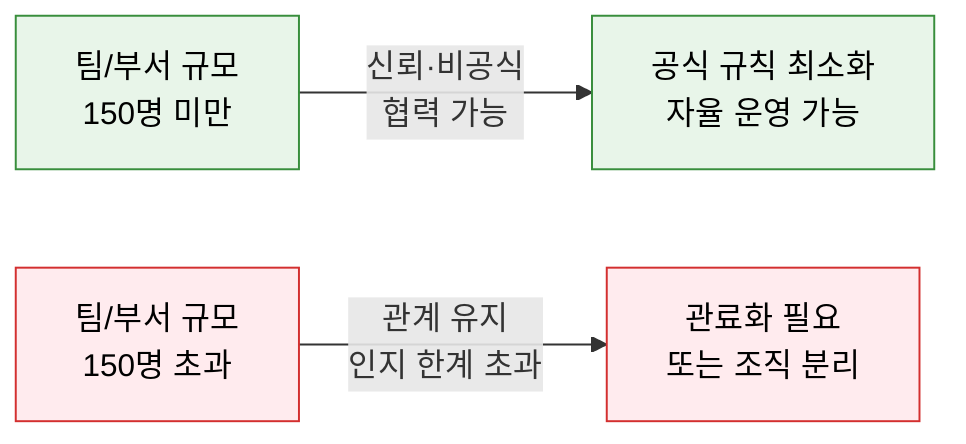

# Dunbar's Number
**인지적 사회 관계의 한계와 조직 규모 설계 원칙**

## 1. 인간이 안정적인 사회적 관계를 유지할 수 있는 인지적 한계를 계층별로 정의하여 조직 설계에 적용하는 원칙, Dunbar's Number의 개요

**개념**: 영국 인류학자 Robin Dunbar가 영장류의 신피질(Neocortex) 크기와 집단 규모의 상관관계 연구에서 도출한 이론으로, 인간이 **안정적인 사회적 관계를 유지할 수 있는 상한선은 약 150명** 이며, 이를 중심으로 5·15·50·150·500의 동심원 계층 구조로 친밀도별 관계 용량을 정의하는 사회 인지 이론.

**특징**:
- 150명을 초과하면 공식적 규칙·계층·관료제 없이는 집단을 유지하기 어려워짐.
- Spotify의 Squad/Tribe 모델·Amazon의 "Two-Pizza Rule"·Gore-Tex의 150명 공장 분리 정책이 던바의 수를 실무에 적용한 사례.
- 팀 크기뿐 아니라 **원격 근무·비동기 협업 환경** 에서 관계 유지 비용이 더 높아져 더 작은 팀 설계가 중요해짐.

---

## 2. Dunbar's Number의 핵심 구성 체계

### 가. 던바의 수 계층 구조

**계층별 관계 특성**

| 계층 | 규모 | 관계 특성 | 소통 방식 | IT 조직 적용 |
|---|---|---|---|---|
| **친밀한 동맹** | ~5명 | 무조건적 신뢰·즉각 지원 | 수시 대화·즉시 연락 | 페어 프로그래밍 파트너·핵심 Tech Lead |
| **신뢰 그룹** | ~15명 | 깊은 신뢰·솔직한 피드백 | 일일 스탠드업·주간 1:1 | Scrum 팀·소규모 피처 팀 |
| **긴밀한 집단** | ~50명 | 긴밀한 협력·역할 조율 | 격주 팀 미팅·슬랙 채널 | 스쿼드 클러스터·소규모 부서 |
| **던바의 수** | ~150명 | 안정적 신뢰 관계 유지 한계 | 월례 타운홀·조직 뉴스레터 | 소규모 스타트업·사업 부서 |
| **친분 집단** | ~500명 | 얼굴은 알지만 깊은 관계 아님 | 분기 전사 미팅 | 중견 기업 사업부 |

---

### 나. 조직 설계 및 팀 규모 최적화 적용

**팀 규모별 커뮤니케이션 채널 수와 적정 규모**

| 팀 규모 | 통신 채널 수 | 관리 복잡도 | 권장 구조 |
|---|---|---|---|
| **3~5명** | 3~10개 | 매우 낮음 | 페어·소규모 핵심 팀 |
| **6~10명** | 15~45개 | 낮음 | **Two-Pizza Rule 적정 범위** |
| **10~15명** | 45~105개 | 중간 | Scrum 팀 최대 규모 |
| **15~50명** | 105~1,225개 | 높음 | 팀 분리·서브 팀 구조 필요 |
| **150명 초과** | 11,175개+ | 매우 높음 | 공식 계층·프로세스·규칙 필수 |

**150명 법칙 — 조직 분리 시점**

---

## 3. Dunbar's Number 적용의 기대효과 및 활용 방안

| 구분 | 주요 기대효과 | 활용 및 실무 적용 방안 |
|---|---|---|
| **팀 설계** | 인지 한계 기반의 최적 팀 규모 산정으로 소통 효율 향상 | 애자일 팀 구성 시 6~10명 기준 적용, 15명 초과 시 분리 검토 |
| **조직 확장** | 150명 돌파 시점에 조직 문화 유지를 위한 분리 계획 수립 | 스타트업 성장 시 150명 전후 조직 구조 재설계 로드맵 준비 |
| **원격 팀 관리** | 비대면 환경에서 관계 유지 비용 증가를 고려한 더 작은 팀 설계 | 리모트 팀은 5~8명 단위로 구성하여 심층 관계 유지 |
| **MSA 팀 구조** | 마이크로서비스 팀을 Two-Pizza Rule 기반으로 설계 | 서비스 경계(DDD Bounded Context)와 팀 규모를 던바의 수로 정렬 |
