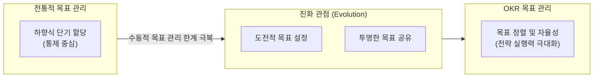
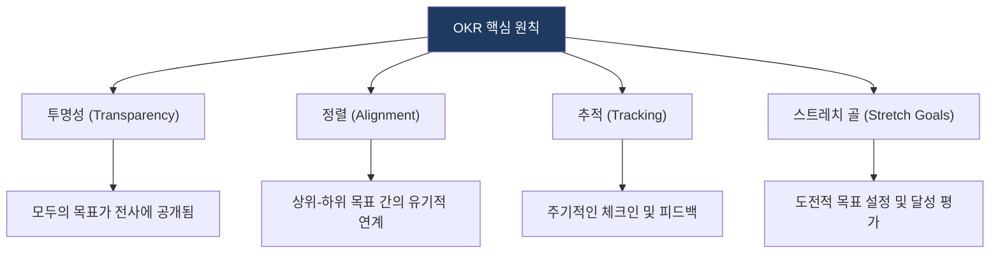

# OKR (Objectives and Key Results)
**Objectives and Key Results**

## 1. 도전적 목표 설정을 통한 성과 창출, OKR의 개요

**정의**: 조직의 목표(Objectives)와 그 목표 달성 여부를 측정할 수 있는 핵심 결과(Key Results)를 정의하여 성과를 관리하는 프레임워크.

**특징**:  
 **(도전적 목표)** 달성률 70%를 기준으로 설정하는 도전적 Objective로 혁신적 성과 추구를 장려.  
 **(분기 주기)** 분기 단위의 짧은 실행·검토 주기로 환경 변화에 빠르게 대응하며 방향을 조정.  
 **(투명한 공유)** 전 조직 OKR을 공개 공유하여 협업과 전략 정렬을 자발적으로 촉진.  

---

## 2. OKR의 구성 요소 및 운영 메커니즘

### 가. 목표 관리 체계의 진화 (OKR)

| 구성 요소 | 정의 및 특징 | 예시 |
|---|---|---|
| **Objective** | 무엇을 달성할 것인가? (질적 지표) | "국내 최고의 사용자 경험을 제공하는 커머스 플랫폼이 된다." |
| **Key Result** | 달성 여부를 어떻게 알 수 있는가? (양적 지표) | "사용자 재방문율 20% 증가", "평균 로딩 속도 1.5초 달성" |

---

### 나. OKR 운영 주기 (Cycle) 및 원칙

| 단계 | 활동 내용 | 비고 |
|---|---|---|
| **Drafting** | 전사 전략 기반의 팀별 OKR 초안 작성 | 연간/분기별 설정 |
| **Check-in** | 주간 단위의 진행 상황 공유 및 장애물 제거 | 지속적 소통 및 조정 |
| **Grading** | 종료 시점의 성과 측정 및 점수 부여 | 0.0 - 1.0 점수 체계 |
| **Retrospective** | 회고를 통한 학습 및 다음 분기 반영 | 성패 원인 분석 및 개선 |

---

## 3. OKR 도입의 기대효과 및 성공 전략

| 구분 | 주요 기대효과 | 활용 및 실무 적용 방안 |
|---|---|---|
| **집중 (Focus)** | 핵심 우선순위에 역량 집중 | 불필요한 업무 제거 및 조직 리소스의 효율적 배분 |
| **정렬 (Alignment)** | 전사적 방향성 일치 | 각 팀의 노력이 회사의 궁극적 목표 달성으로 수렴 |
| **자율성 (Autonomy)** | 상향식 목표 설정을 통한 동기부여 | 팀 스스로 KR을 정의하여 실행력 및 책임감 제고 |
| **민첩성 (Agility)** | 짧은 주기의 유연한 목표 수정 | 급변하는 시장 환경에 맞춰 비즈니스 방향 즉각 조정 |
