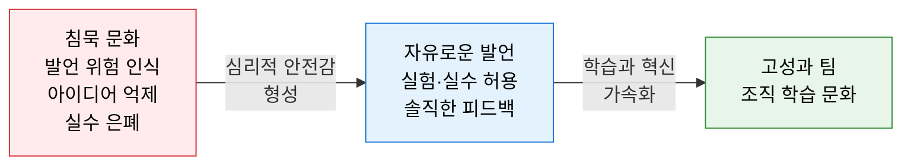
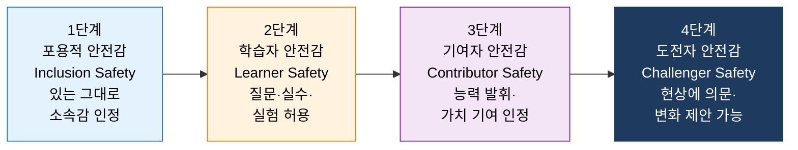
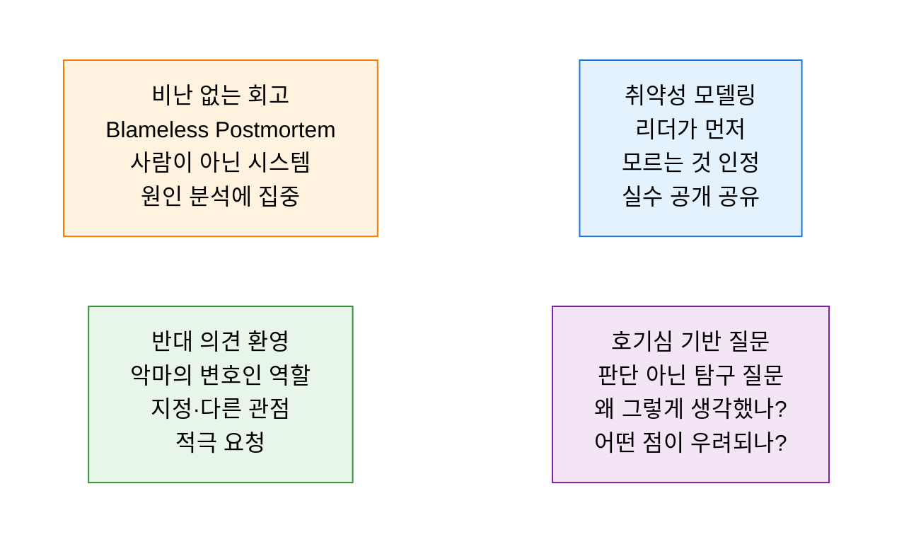

# Psychological Safety
**심리적 안전감 — 고성과 팀을 만드는 핵심 조건**

## 1. 팀원이 대인 관계 위험 없이 자유롭게 발언·실험·실수할 수 있다고 믿는 공유 신념, 심리적 안전감의 개요

**개념**: Amy Edmondson(하버드 경영대학원) 교수가 제시한 개념으로, 팀 내에서 **대인 관계 위험(Interpersonal Risk) 없이** 질문·아이디어 제안·우려 표명·실수 인정을 할 수 있다고 팀원들이 공유하는 신념. Google의 Project Aristotle 연구에서 고성과 팀의 가장 중요한 단일 요인으로 확인됨.

**특징**:
- 심리적 안전감은 **안락함(Comfort)** 이 아님 — 낮은 기준·낮은 책임이 아닌 **높은 기준 속 안전한 환경** 이 목표.
- 리더십 행동이 팀의 심리적 안전감 수준에 가장 큰 영향을 미침.
- Google Project Aristotle: 심리적 안전감이 팀 효과성을 결정하는 **5대 요인 중 1위** (다음은 의존성·구조·의미·영향).

---

## 2. 심리적 안전감의 핵심 구성 체계

### 가. 심리적 안전감의 4단계 수준 (Timothy Clark 모델)

| 단계 | 핵심 질문 | 팀원이 느끼는 것 | 리더 행동 |
|---|---|---|---|
| **1. 포용적 안전감** | "나는 여기 소속되어 있는가?" | 인종·나이·성별 무관 동등 대우받음 | 개인 존중·다양성 수용·소속감 표현 |
| **2. 학습자 안전감** | "질문하거나 실수해도 안전한가?" | 모르는 것을 물어봐도 비웃음받지 않음 | 질문 환영·실수를 학습 기회로 프레이밍 |
| **3. 기여자 안전감** | "내 의견과 능력이 인정받는가?" | 아이디어를 낼 때 무시당하지 않음 | 기여 인정·자율성 부여·권한 위임 |
| **4. 도전자 안전감** | "현상에 의문을 제기해도 안전한가?" | 리더·프로세스에 반론을 제기할 수 있음 | 반대 의견 적극 환영·비판적 사고 장려 |

---

### 나. 고성과 팀 구축을 위한 리더십 실천

**심리적 안전감을 저해하는 리더 행동 vs 촉진하는 리더 행동**

| 구분 | 저해 행동 | 촉진 행동 |
|---|---|---|
| **실수 대응** | 공개적 질책·망신·책임 추궁 | 비난 없는 분석·학습 기회로 전환 |
| **의견 반응** | 즉각 반박·묵살·무시 | "흥미로운 관점이네요, 더 말해줘요" |
| **회의 운영** | 리더 발언 우선·침묵 방치 | 가장 낮은 직급부터 발언·익명 의견 수렴 |
| **실패 처리** | 실패자 낙인·승진 불이익 | 실패에서 배운 것 공유·실험 장려 |
| **정보 공유** | 정보 독점·필요한 정보 차단 | 맥락·배경 투명 공개·알 권리 보장 |

**심리적 안전감 진단 설문 (Edmondson 7문항 요약)**

| 문항 | 낮음 → 높음 척도 (1~7) |
|---|---|
| 이 팀에서는 위험을 감수할 수 있다 | 1 ————————————— 7 |
| 팀원이 문제를 제기하기 쉽다 | 1 ————————————— 7 |
| 이 팀에서는 나만의 독특한 능력이 활용된다 | 1 ————————————— 7 |
| 실수해도 나를 비난하지 않는다 | 1 ————————————— 7 |
| 다양한 배경을 가진 사람들을 거부하지 않는다 | 1 ————————————— 7 |

---

## 3. 심리적 안전감 구축의 기대효과 및 활용 방안

| 구분 | 주요 기대효과 | 활용 및 실무 적용 방안 |
|---|---|---|
| **혁신 가속** | 아이디어 자유 제안으로 창의적 문제 해결 증가 | 스프린트 레트로에서 비판 없는 아이디어 수집 세션 운영 |
| **조기 경보** | 리스크·문제를 숨기지 않고 즉각 공유 | 포스트모텀을 비난 없이 진행하여 장애 재발 방지 문화 정착 |
| **학습 조직** | 실수를 학습 자산으로 전환하여 조직 역량 축적 | 실패 사례를 팀 지식 베이스에 '배움 기록'으로 공유 |
| **인재 유지** | 심리적 안전감 높은 팀은 이직률 감소·몰입도 향상 | 분기별 팀 심리적 안전감 진단 설문 실시 및 개선 실행 |
