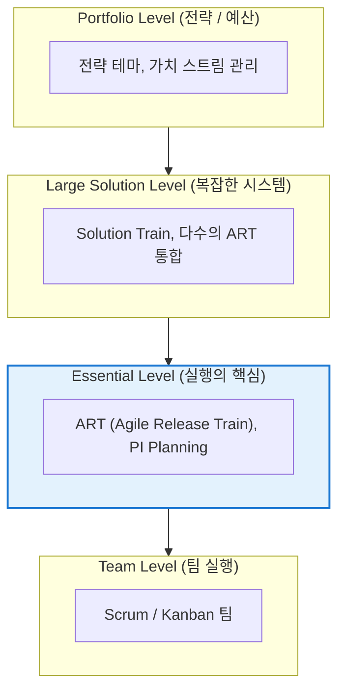
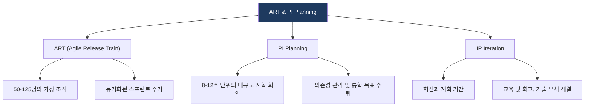

# SAFe (Scaled Agile Framework)
**Scaled Agile Framework**

## 1. 대규모 조직을 위한 애자일 표준, SAFe의 개요

**개념**: 대규모 엔터프라이즈 환경에서 수십, 수백 명의 인원이 협업하여 복잡한 시스템을 개발하기 위해 애자일과 린(Lean) 원칙을 확장한 프레임워크.

**특징**: **ART(Agile Release Train)** 중심의 실행, 포트폴리오 수준의 전략 정렬, 역할과 프로세스의 정교한 구조화(Level별 구성).

---

## 2. SAFe의 핵심 구성 체계 및 운영 모델

### 가. SAFe의 4가지 구성 수준 (Core Competencies)

| 수준 | 핵심 역할 및 활동 | 비고 |
|---|---|---|
| **Essential** | ART 구성을 통한 주기적 릴리스 | SAFe의 가장 기본적이고 필수적인 수준 |
| **Portfolio** | 전략적 방향 설정 및 가치 스트림 기반 예산 배분 | 비즈니스 민첩성 확보의 핵심 |
| **Large Solution** | 거대 시스템(예: 항공기, 자율주행 등) 개발을 위한 협업 | 다수의 ART 간 동기화 |

---

### 나. ART (Agile Release Train) 및 PI Planning

| 주요 개념 | 상세 설명 | 역할 |
|---|---|---|
| **RTE** | Release Train Engineer | ART의 스크럼 마스터 역할, 열차 운행 촉진 |
| **Product Mgt** | 제품 관리자 | ART 수준의 백로그 우선순위 및 비전 제시 |
| **System Arch** | 시스템 아키텍트 | 기술적 일관성 및 공유 아키텍처 설계 |

---

## 3. SAFe 도입의 기대효과 및 고려사항

| 구분 | 주요 기대효과 | 활용 및 실무 적용 방안 |
|---|---|---|
| **전사적 정렬** | 전략과 실행의 일치 | 포트폴리오부터 팀까지 단일화된 가시성 확보 |
| **예측 가능성** | 케이던스(Cadence) 기반의 일정 관리 | PI Planning을 통한 의존성 사전 해결 및 일정 준수율 제고 |
| **품질 내재화** | 시스템 수준의 품질 보증 | Built-in Quality 프랙티스를 통한 기술 부채 최소화 |
| **비즈니스 가치** | 가치 스트림 중심의 조직 개편 | 기능별 조직(Silo)에서 목적형 조직으로의 전환 유도 |
