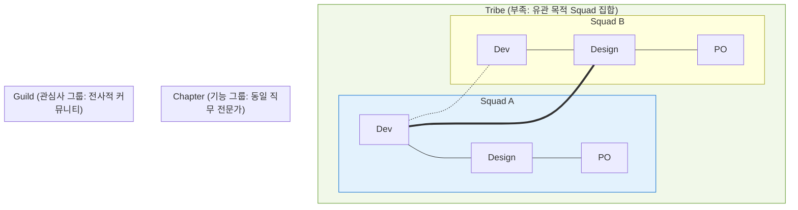
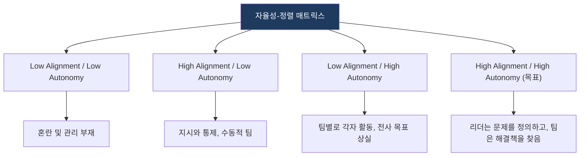

# Spotify Model
**Spotify's Engineering Culture & Organization**

## 1. 자율성과 정렬의 균형, 스포티파이 모델의 개요

**개념**: 음원 스트리밍 서비스 Spotify에서 개발한 조직 구조로, 소규모 팀의 자율성(Autonomy)을 극대화하면서도 전사적 방향성(Alignment)을 유지하기 위한 목적 중심의 매트릭스 조직 모델.

**특징**: **Squad, Tribe, Chapter, Guild**라는 독특한 조직 단위 정의, "Fail Fast, Learn Fast" 문화, 기술적 부채 관리 중시.

---

## 2. 스포티파이 모델의 조직 구성 단위

### 가. 목적 중심과 기능 중심의 조화 (Squad to Guild)

| 단위 | 성격 | 주요 역할 |
|---|---|---|
| **Squad** | 목적 중심 (Cross-functional) | 서비스의 특정 기능을 엔드 투 엔드로 책임지는 최소 단위 |
| **Tribe** | 도메인 중심 (집합체) | 유관한 비즈니스 영역을 담당하는 여러 Squad의 연합 |
| **Chapter** | 기능 중심 (수직적) | 동일 직무(예: Backend, iOS) 개발자들의 역량 강화 및 표준화 |
| **Guild** | 관심 중심 (수평적) | 직무와 관계없이 특정 주제(예: 보안, 성능)에 대한 전사적 지식 공유 |

---

### 나. 스포티파이의 자율성-정렬 매트릭스

| 핵심 원칙 | 설명 | 비고 |
|---|---|---|
| **자율성** | 팀이 문제를 해결하는 방식을 스스로 결정함 | 동기 부여 및 속도 향상 |
| **정렬** | 모든 팀이 회사의 비전과 전략을 이해하고 같은 방향을 바라봄 | 일관된 비즈니스 가치 창출 |
| **느슨한 결합** | 서비스 간 의존성을 최소화하여 독립적 배포 가능 | 기술적 기민성 확보 |

---

## 3. 스포티파이 모델의 기대효과 및 실무 적용 방안

| 구분 | 주요 기대효과 | 활용 및 실무 적용 방안 |
|---|---|---|
| **혁신 속도** | 의사결정 단계 축소 | Squad 단위의 빠른 실험과 릴리스 주기 정착 |
| **인재 성장** | Chapter를 통한 기술 역량 강화 | 동일 직무 전문가 간의 코드 리뷰 및 베스트 프랙티스 공유 |
| **문화적 응집력** | Guild를 통한 지식 파편화 방지 | 조직 규모가 커져도 전사적 기술 표준 및 문화 유지 |
| **리스크 분산** | 장애 격리 및 빠른 복구 | 마이크로서비스(MSA)와 연계하여 시스템 안정성 제고 |
