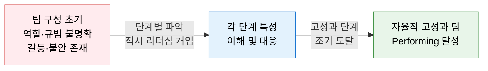
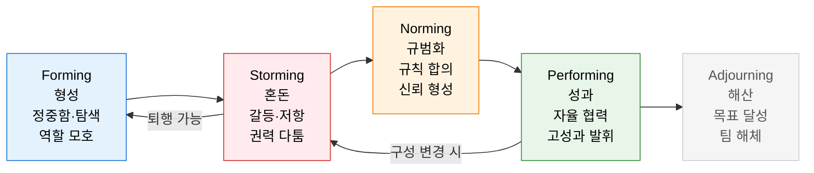
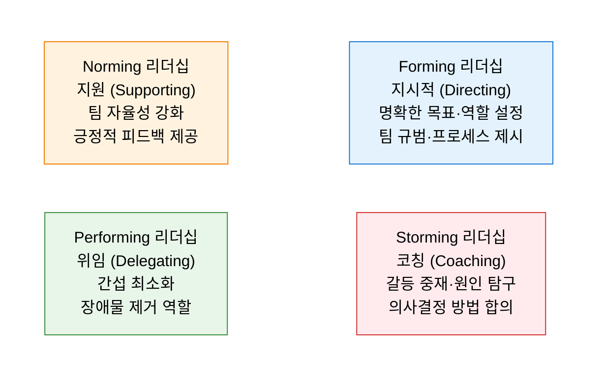

# Tuckman Stages
**팀 발달 단계 모델 — Forming · Storming · Norming · Performing · Adjourning**

## 1. 팀이 구성부터 고성과 달성까지 거치는 4+1단계 발달 과정을 정의하여 리더십 개입을 최적화하는 모델, Tuckman Stages의 개요

**개념**: Bruce Tuckman(1965)이 제안하고 후에 Mary Ann Jensen과 함께 Adjourning 단계를 추가한 팀 발달 모델로, 팀이 구성된 이후 **Forming(형성) → Storming(혼돈) → Norming(규범화) → Performing(성과)** 의 4단계를 거쳐 고성과에 도달하며, 프로젝트 완료 시 **Adjourning(해산)** 단계로 종료되는 팀 발달 과정을 설명.

**특징**:
- 모든 팀은 반드시 이 순서대로 단계를 거침 — **건너뛸 수 없으며 퇴행도 가능** (멤버 교체·목표 변경 시 Storming 재발).
- 리더는 각 단계에서 요구되는 **리더십 스타일이 다름** — 초기는 지시적, 후반은 위임적.
- 단계를 인식하는 것만으로도 팀원·리더 모두의 **불안과 갈등 수용력** 이 높아짐.

---

## 2. Tuckman Stages의 핵심 구성 체계

### 가. 4+1 단계 팀 발달 모델

**단계별 팀 특성 상세**

| 단계 | 팀 분위기 | 팀원 행동 | 생산성 수준 | IT 팀 적용 예시 |
|---|---|---|---|---|
| **Forming** | 정중·조심·기대·불안 | 서로 탐색·역할 관찰·지시 기다림 | 낮음 | 킥오프 미팅·온보딩·팀 빌딩 |
| **Storming** | 갈등·좌절·경쟁·저항 | 역할 경쟁·방법론 충돌·리더십 도전 | 최저 | 개발 방식 논쟁·코드 리뷰 갈등 |
| **Norming** | 신뢰·응집·협력·규칙 | 역할 합의·피드백 교환·공통 작업 방식 | 상승 | 코딩 컨벤션·회의 규칙·리뷰 문화 정착 |
| **Performing** | 자율·몰입·상호 의존·성취 | 자기 조직화·창의적 해결·상호 지원 | 최고 | 자율 스프린트·기술적 도전 해결 |
| **Adjourning** | 성취감·아쉬움·불안·이별 | 성과 정리·지식 이전·관계 마무리 | 하락 | 프로젝트 완료·팀 해산·레트로스펙티브 |

---

### 나. 단계별 리더십 개입 전략

**단계별 리더십 체크리스트**

| 단계 | 리더가 해야 할 것 | 리더가 하지 말아야 할 것 |
|---|---|---|
| **Forming** | 명확한 목표·역할·기대치 설정, 팀 빌딩 활동 주관 | 갈등을 미리 막으려 지나치게 통제 |
| **Storming** | 갈등을 숨기지 말고 표면화·해결, 이해충돌 중재 | 갈등을 회피하거나 강압으로 억누름 |
| **Norming** | 자율성 점진적 이양, 팀 합의 사항 존중 | 이미 합의된 규범을 리더 독단으로 변경 |
| **Performing** | 자원 확보·장애물 제거, 성과 인정·축하 | 성과 달성 팀에 불필요한 감시·간섭 |
| **Adjourning** | 성과 공식 인정, 지식 문서화, 이별 의식 진행 | 해산을 사무적으로만 처리, 감사 표현 생략 |

**IT 프로젝트에서 Storming 재발 유발 요인**

| 유발 요인 | 영향 | 대응 |
|---|---|---|
| 핵심 멤버 교체 | 역할·신뢰 재설정 필요 | 온보딩 세션 + 팀 역할 재합의 |
| 기술 스택 변경 | 전문성 경쟁·불안 재발 | 기술 전환 교육 + 의사결정 투명화 |
| 목표·우선순위 급변 | 방향 혼란·개인 이해충돌 | 전체 팀 목표 재설정 워크숍 |
| 리더십 교체 | 권력 공백·새 리더 도전 | 전임·신임 리더 협력 인수인계 |

---

## 3. Tuckman Stages 이해의 기대효과 및 활용 방안

| 구분 | 주요 기대효과 | 활용 및 실무 적용 방안 |
|---|---|---|
| **갈등 정상화** | Storming을 비정상이 아닌 필수 과정으로 인식 | 팀 갈등 발생 시 "지금 Storming 단계"로 프레이밍하여 불안 해소 |
| **리더십 최적화** | 단계별 맞춤 리더십으로 팀 발달 가속 | Forming은 지시적, Performing은 위임적으로 리더십 스타일 전환 |
| **팀 진단** | 현재 팀의 발달 단계를 진단하여 개입 방향 결정 | 월간 팀 회고에서 "우리는 지금 어느 단계인가?" 자가 진단 |
| **애자일 연계** | 스프린트 팀 구성 변경 시 Storming 재발 예측·대비 | 새 멤버 합류 시 팀 빌딩 세션으로 Forming 단계 가속 |
